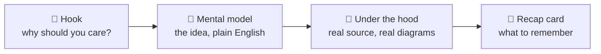

# How to Read This Book

<div class="youarehere">📍 <strong>You are here:</strong> Part Zero · Settle In</div>

Every chapter in this book follows the same four-beat rhythm. Once you notice it, you can skim strategically — or slow down and savor.

## The rhythm of a chapter



1. **Hook** — a small, honest reason the topic matters.
2. **Mental model** — the concept explained like we're two friends at a whiteboard. Analogies allowed. Jargon banned until defined.
3. **Under the hood** — now we open drawers: actual source with `file → line` pointers, mermaid diagrams of real data flow, and runnable Sindlish snippets.
4. **Recap card** — a boxed TL;DR at the end. Read only these on your first pass, and you'll still understand the language.

## Conventions used everywhere

| Convention | Meaning |
|---|---|
| `interpreter/backend/vm.py:206` | Source anchor — file, then line number. Clickable in most editors via Ctrl+P + filename. |
| ```sd code fences``` | Sindlish source. Every snippet is verified against the interpreter. |
| `LOAD_FAST`, `STORE_GLOBAL` | Bytecode opcodes — always SHOUTING_CASE. Defined in [Opcode Field Guide](opcodes.md). |
| `SdNumber`, `SdType` | Python classes inside the interpreter (the "Sd" = *Sindlish*). |
| `adad`, `likh` | Sindlish keywords (italicized *meaning* on first use: `adad` = number). |

### Reading paths

The chapters form one linear path, but three shortcuts exist:

- **"Just let me add my feature"** → read [One Program's Journey](journey.md), then skip straight to [Add a Feature End-to-End](contributing.md), hopping back as needed.
- **"I only care about types & safety"** → [Resolver](resolver.md) → Part Three → [Safety](safety.md).
- **"I want to build an interpreter someday"** → read everything in order. Part Seven is written for exactly you.

## Verifying things yourself

Two habits worth building early:

```bash
# Run any snippet from this book
python main.py run scratch.sd

# See what the lexer/parser see before anything executes
python main.py tokens scratch.sd
python main.py ast scratch.sd
```

When this book shows interpreter output, it's real output. When you're unsure whether a claim is true, run it — that's not just allowed here, it's the culture.

> 💡 **Cozy tip:** keep `scratch.sd` open next to the book. This whole subject clicks fastest when you're typing along.

<div class="recap">
<p>Chapters follow Hook → Mental model → Under the hood → Recap.</p>
<p><code>file:line</code> anchors point into the real source; every <code>.sd</code> snippet runs.</p>
<p>Three reading paths exist: full journey, feature-hacker, and type-safety specialist.</p>
</div>
