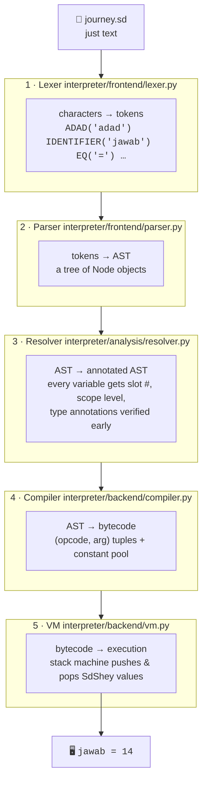

# One Program's Journey

<div class="youarehere">📍 <strong>You are here:</strong> Part One · The Big Picture</div>

The fastest way to understand an interpreter is to follow **one program** through it. So meet our tour specimen — six lines that use a function, arithmetic, variables, and printing:

```sd
# journey.sd
kaam jor(a, b) -> adad {      # "work" — define a function named jor (join)
    wapas a + b               # give back a + b
}

adad jawab = jor(3, 4) * 2    # jawab ("answer") = (3+4) * 2
likh("jawab =", jawab)        # write it out
```

Running it prints `jawab = 14`. Here's the full odyssey it takes to get there:



Now each stop in detail — what arrives, what leaves.

## Stop 1 · Lexer: text becomes labeled pieces

The lexer (`interpreter/frontend/lexer.py`) reads characters left-to-right and chops them into **tokens**: little `(type, value, line, column)` records. It knows nothing about grammar — only about *words*.

You can watch it work on any file:

```
> python main.py tokens tokens-demo.sd      # where the file contains: adad x = 3 + 4

ADAD('adad')
IDENTIFIER('x')
EQ('=')
ADAD(3)
PLUS('+')
ADAD(4)
NEWLINE('\\n')
EOF(None)
```

Note how `adad` became token type `ADAD` — the keyword table (`interpreter/frontend/keywords.py`) maps Sindhi words to types during scanning. Also notice `NEWLINE` is a real token here; Sindlish uses braces `{ }` for blocks but newlines still separate statements.

**In:** raw string · **Out:** flat list of tokens.

## Stop 2 · Parser: pieces become a tree

The parser (`interpreter/frontend/parser.py`) is a classic **recursive descent** parser: one method per grammar rule, precedence encoded by which method calls which. It consumes the token list and grows an **AST** — Abstract Syntax Tree — where each node is one of the 36 classes in `ast_nodes.py`.

For the two statements of our specimen (function-free demo shown for readability):

```
ProgramNode(statements=[
  AssignNode(name='x', value=BinaryOpNode(
      left=NumberNode(value=3), op=PLUS('+'), right=NumberNode(value=4)), ...),
  CallNode(name='likh', args=[BinaryOpNode(
      left=VariableNode(name='x'), op=MUL('*'), right=NumberNode(value=2))])
])
```

Two things worth savoring:

- Precedence isn't stored anywhere — it's *baked into the tree's shape*. `3 + 4` is one node; if you'd written `2 * (3 + 4)` the `+` would sit deeper.
- The parser already rejects nonsense: `likh(` with no closing paren dies right here with a `LikhaiJeGhalti` (*writing-mistake*), long before anything executes.

**In:** tokens · **Out:** `ProgramNode` tree.

## Stop 3 · Resolver: the tree learns its addresses

The resolver (`interpreter/analysis/resolver.py`, ~460 lines) walks the AST and answers questions the compiler can't:

1. **Where does each name live?** Every local variable gets a numbered **slot** in its frame — `x` becomes slot 0. Lookups become O(1) array reads instead of dict lookups.
2. **Which scope?** Local (`scope_level = 0`), global (`1`), or captured closure cell (`2`).
3. **Are the annotations honest?** `adad x = 3 + 4` claims `x` is an integer; the resolver infers the literal type of the right side and checks *now*, before running.

After this pass, nodes carry extra fields: `AssignNode(slot_index=0, scope_level=0, has_explicit_type=True)`. The tree looks the same when printed, but every variable now has a home address.

This stage is also where **hybrid typing** lives — dynamic by default, static whenever you annotate — which is Part Three's whole subject.

## Stop 4 · Compiler: the tree becomes a to-do list

The compiler (`interpreter/backend/compiler.py`) flattens the annotated AST into **bytecode**: a list of `(opcode, argument)` pairs plus a **constant pool** of pre-built values. Our expression compiles to something like:

```text
LOAD_CONST   0     ; push SdNumber(3)
LOAD_CONST   1     ; push SdNumber(4)
BINARY_ADD         ; pop two, push sum
STORE_GLOBAL x     ; bind name 'x' (top-level vars live in globals)
...
CALL_FUNCTION likh ; run the builtin
HALT               ; stop the machine
```

Notice the compiler makes no decisions about *meaning* — `BINARY_ADD` will happily add numbers, strings, or lists, because that decision belongs to the value itself at runtime.

## Stop 5 · VM: a very obedient stack machine

The virtual machine (`interpreter/backend/vm.py`, ~880 lines) is almost boring in the best way. It keeps:

- a **stack** of values,
- a list of **frames** (one per active function call),
- and a giant `if/else` — actually a dispatch table — mapping each opcode to a tiny handler method.

`step()` reads one instruction, calls its handler, repeat. That's the entire execution model. When `BINARY_ADD` runs, it pops two values and asks the *left one* to add: `left.call_method("__add__", [right])`. Numbers know how to add themselves; lists know how to concatenate. The VM never does arithmetic — it just moves values around and delegates.

## Why five stages at all?

Because each stage catches a different category of mistake at the cheapest possible moment:

| Stage | Mistakes it kills | Cost when caught |
|---|---|---|
| Lexer | illegal characters, unterminated strings | cheapest |
| Parser | malformed syntax | cheap |
| Resolver | unknown names, dishonest type annotations, scope errors | medium |
| Compile | structural impossibilities (e.g. `tor` outside a loop) | medium |
| VM | genuine runtime failures (bad index, zero division…) | expensive — but unavoidable |

A typo should never survive to runtime; a missing list element *can't* be caught earlier. The pipeline is a series of increasingly strict filters, ordered so that everything cheap happens first.

<div class="recap">
<p>Five stages: Lexer → Parser → Resolver → Compiler → VM.</p>
<p>Tokens are labeled words; the AST bakes precedence into shape; the resolver gives names addresses (slots); bytecode is (opcode, arg) pairs; the VM is a dispatch table over a stack.</p>
<p>Each stage exists to kill one class of bugs as early as possible.</p>
</div>
