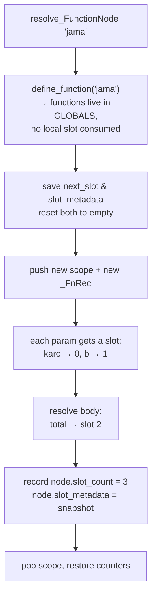
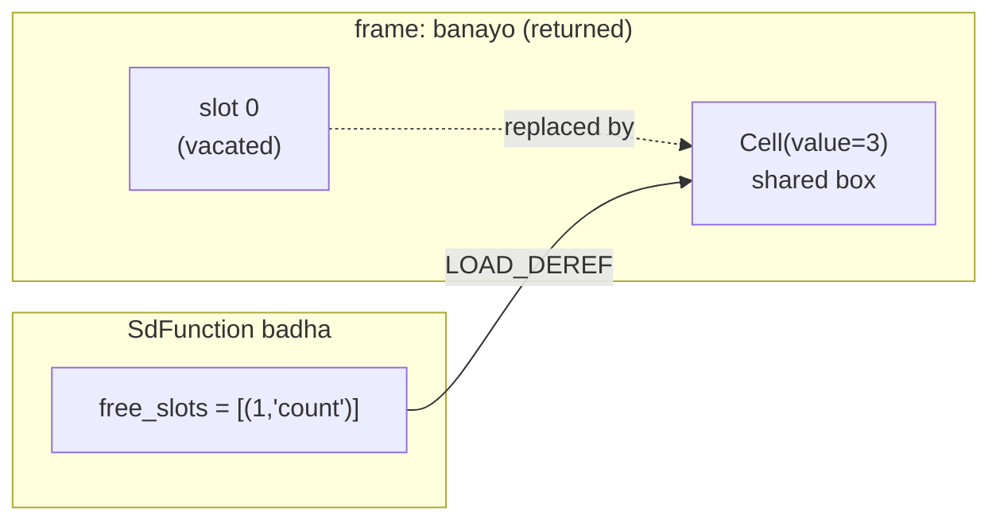

# The Resolver: Names, Slots & Scopes

<div class="youarehere">📍 <strong>You are here:</strong> Part Two · Front of House — stage 3 of 5</div>

## 🌱 The hook

After parsing, the AST knows *what* your program says — but not *where anything lives*. When line 12 says `count = count + 1`, which `count`? The one from line 2? A global? A variable in an enclosing function that this function merely borrowed?

The resolver (`interpreter/analysis/resolver.py`, ~770 lines) answers all of it in one walk, **before any code runs**. It's the interpreter's accountant: every name gets audited, every variable gets a numbered mailbox (a **slot**), and dishonest type annotations get flagged while correction is still cheap.

This chapter is the deepest of Part Two — scopes, slots, closures and all — because half the language's safety story stands on what happens here.

## 🧠 Mental model: mailboxes in every apartment

Picture each function call as an apartment. Inside, variables live in **numbered mailboxes** (`slot 0`, `slot 1`, …). Reading mailbox #2 is an O(1) array access at runtime — no dictionary probing, no string hashing.

The resolver is the clerk who, before move-in day:

1. walks the whole building (the AST),
2. assigns every declared variable its mailbox number,
3. writes the number on the AST node itself (`node.slot_index`),
4. records whether the name lives in *this* apartment (local, level 0), the *building lobby* (global, level 1), or in a *neighboring apartment's* box it's allowed to reach into (captured cell, level 2).

Those three levels are the entire scoping vocabulary:

| Level | Meaning | Runtime opcode |
|---|---|---|
| `0` | local slot in current frame | `LOAD_FAST` / `STORE_FAST` |
| `1` | program-global environment | `LOAD_GLOBAL` / `STORE_GLOBAL` |
| `2` | closure cell shared with an enclosing function | `LOAD_DEREF` / `STORE_DEREF` |

## 🔬 Under the hood

### The clerk's desk (core data structures)

```python
# interpreter/analysis/resolver.py:29
class Resolver:
    def __init__(self, code):
        self.scopes = [{}]  # stack of {name: slot_index}
        self.function_scopes = [set()]  # names registered as functions per scope
        self.fn_records = [_FnRec()]  # closure bookkeeping per function
        self.scope_rec = [self.fn_records[0]]  # which fn owns each scope
        self.declared_globals = set()  # names via 'aalmi'
        self.global_var_names = set()  # names proven to be top-level
        self.next_slot = 0  # mailbox counter
        self.slot_metadata = {}  # slot → {"is_const", "type", "element_type"}
        self.symbols = []  # LSP feed (name, type, line, col, kind)
```

Dispatch is by naming convention (`resolver.py:156`): visiting an `IfNode` calls `resolve_IfNode`; nodes without a dedicated method get a generic visitor that recurses into every `__slots__` attribute (`resolver.py:168`).

### Walkthrough 1 — a plain function gets dressed

```sd
kaam jama(karo, b) -> adad {
    adad total = karo + b
    wapas total
}
```

Follow the clerk's hands through `resolve_FunctionNode` (`resolver.py:656`):



Resulting annotations on the tree:

| Node | slot_index | Notes |
|---|---|---|
| `ParamNode karo` | `0` | |
| `ParamNode b` | `1` | |
| `AssignNode total` | `2` | metadata `{type: ADAD}` since annotated |

Two decisions deserve attention:

- **Function names don't occupy slots.** `define_function` (`resolver.py:456`) just registers the name; references compile to `LOAD_GLOBAL`. This came out of bug-fix history — the older scheme reserved slots for function values and broke top-level reads.
- **Stored functions call too.** Copy a function into a variable and call it — `fn = wadho; wapas fn(2, 3)` — and the resolver stamps the local/captured callee (`resolve_CallNode`, `resolver.py:585`); the compiler then routes it through `LOAD_FAST`/`LOAD_DEREF` + `CALL_VALUE` instead of the globals-only `CALL_FUNCTION` path. This closed the phase-two gap where a named call to a *local* function silently failed to resolve.
- **Slot counting restarts per function** and the old counter is restored after. Each apartment numbers its own mailboxes starting at zero.

### Walkthrough 2 — blocks don't create scopes

`resolve_BlockNode` (`resolver.py:199`) resolves a block body **inside the current scope** — flat, Python-style scoping. A name bound inside a block belongs to the enclosing function, or to the program globals at top level, so it stays visible after the block closes. Control-flow blocks — `agar`, `jab tak`, loop bodies — never push a scope; only a nested `kaam` body does, and that is a genuine **function** scope with its own slot numbering (see Walkthrough 1).

```sd
kaam test() {
    adad x = 1
    agar sach {
        x = 5
        likh(x)
    }
    likh(x)
}
test()
```

Verified output:

```text
5
5
```

There is no second `x`. Assignment resolution consults `_find(name)` first (`resolver.py:474`), which searches *all* enclosing scopes — so the inner `x = 5` simply **reuses slot 0** rather than declaring a fresh variable. Blocks don't give you shadowing; they give you hoisting-free sequential execution where the last write wins.

> ⚠️ **The first type sticks.** Blocks being scope-less means you can't re-declare an annotated variable with a different type in an inner block — and the resolver now *says so* instead of letting it happen silently. After `adad x = 1`, writing `lafz x = "hi"` inside a block raises immediately at that line (verified):
>
> ```text
> QisamJeGhalti: Qisam natho badlo sendho: 'x' pehryoan 'adad' khapyo paye, par 'lafz' milyo.
> ```
>
> The slot keeps its first type (`adad`) forever; an untyped write or a matching type is always fine. This replaced the old behavior, where a typed redeclaration would overwrite the slot's metadata and make the *earlier* line fail mysteriously at runtime (roadmap items 54 & 57 fix note).

### Walkthrough 3 — loops bind their iterator, Python-style

`resolve_ForNode` (`resolver.py:560`) binds the iterator in the *current* scope — an ordinary local slot inside a function, a global at program level (`iterator_slot` -1). The iterator leaks its last value after the loop, exactly like a module-level Python `for` variable:

```sd
har i mein silsilo(3) {
    likh(i)
}
likh(i)
```

Verified output:

```text
0
1
2
2
```

The name `i` doesn't vanish when the loop ends; it keeps the last value it was assigned. If you want a loop-private variable, wrap the loop in a `kaam` or rebind explicitly after.

### Walkthrough 4 — closures: reading is free, writing needs `bahari`

The crown jewel of the resolver. Watch a counter being born:

```sd
kaam banayo() {
    adad count = 0
    kaam badha() {
        bahari count
        count = count + 1
        wapas count
    }
    wapas badha
}
counter = banayo()
likh(counter())   # 1
likh(counter())   # 2
likh(counter())   # 3
```

Why does `count` survive between calls? Because it doesn't live in a slot anymore. When the resolver sees the inner function **read** `count` (`resolve_VariableNode`, `resolver.py:518`), it notices the owner is an *enclosing* `_FnRec` and registers a capture:

```python
def _register_capture(self, name, owner):
    # mark `name` as captured on the owning function,
    # add pass-through entries to every function in between,
    # return the upvalue depth from the innermost function
```

Captured locals are compiled as **cells** — little mutable boxes shared by reference, one per captured name, carrying the variable's name and const/type metadata (`interpreter/objects/core.py:72`). Slots die with their frame; cells die only when nobody references them. That's why `counter()` keeps ticking after `banayo()` has returned.



**Writing** is stricter: assigning to `count` without declaring `bahari count` raises a helpful error immediately during resolution (verified):

```text
QisamJeGhalti: 'count' baharli kaam jo variable aahe;
us khe badhayn laai 'bahari count' likho.
```

Reads auto-capture; writes must announce themselves. Python made the opposite trade-off (declaration for reads via closures is implicit too, but writes need `nonlocal` *and* reads of not-yet-bound names can blow up late) — Sindlish front-loads the decision so nothing surprises you at 2 AM.

Cells are more than dumb boxes: each one carries the captured variable's `name` and its const/type metadata (`interpreter/objects/core.py`). The VM enforces both on every `bahari` write — storing to a `pakko` outer variable raises *"pakko (constant) variable badlaye natho saghjay."*, a mistyped write is rejected by the same type check locals get, and reading an outer variable before it has a value raises a helpful *"'count' khe value likhwan khaan pehrioan read natho thyo sendho (khali cell)."* All three verified.

### Walkthrough 5 — `aalmi`: the escape hatch upward

```sd
kaam badha() {
    aalmi tally
    tally = tally + 1
    wapas tally
}
tally = 0
badha()
badha()
likh(badha())   # verified: 3
```

`resolve_GlobalNode` (`resolver.py:705`) adds `tally` to `declared_globals`, and assignment resolution checks that set (`resolver.py:349`) before anything else — routing the store to `scope_level = 1`. Without the declaration, `tally = …` inside the function would have created a brand-new *local* slot instead (shadowing the global), which is exactly the classic foot-gun `aalmi` exists to prevent.

### Program-level variables are globals

Anything assigned at the top level gets `scope_level = 1`, `slot_index = -1` (`resolver.py:355`) — they live in the globals `Environment`, not in any frame. That single rule is why this just works:

```sd
adad x = 42
kaam foo() {
    wapas x
}
likh(foo())    # verified: 42
```

…and why the REPL keeps variables alive across lines: every `run_source` reuses the same globals `Environment` (`interpreter/__init__.py:31`), and top-level assignments always compile through the checked `STORE_GLOBAL` path. There's no `is_repl` flag in the resolver — persistence falls out of the shared environment.

### Where type checking plugs in

When an `AssignNode` carries an explicit annotation, `resolve_AssignNode` calls `_verify_assignment_types` (`resolver.py:209`) *before* allocating anything: infer the literal's type, compare, raise `QisamJeGhalti` on mismatch — including per-element checks for `fehrist[adad] = ["a", "b"]`-style lies. That machinery is big enough to deserve its own part: see [typing-model.md](typing-model.md) next chapter.

### Gifts for tooling

Two side products leave the resolver richer than it found the tree:

- `symbols` — every defined name with type/position/kind, feeding the VS Code extension's completion.
- `slot_metadata` snapshots per function — shipped into `FunctionNode.slot_metadata`, which the VM later uses to enforce `pakko` and types *inside* function bodies ([safety.md](safety.md)).

<div class="recap">
<p>Resolver = pre-runtime accountant: slots for locals, levels 0/1/2 for local/global/cell.</p>
<p>Functions live in globals (no slot); slot numbering restarts per function.</p>
<p>Blocks create no scopes (flat, Python-style): names bind to the enclosing function or globals. The first type sticks — a conflicting typed redeclaration raises immediately.</p>
<p>Loop iterators live in the current scope and leak their last value after the loop.</p>
<p>Closures: reads capture automatically into shared Cells; writes require <code>bahari</code>; captured locals outlive their frame. Cells enforce const and type on <code>bahari</code> writes.</p>
<p>Functions stored in variables stay callable — local/captured callees route through <code>LOAD_FAST</code>/<code>LOAD_DEREF</code> + <code>CALL_VALUE</code>.</p>
<p><code>aalmi</code> opts into the global; top-level vars are always global.</p>
</div>
