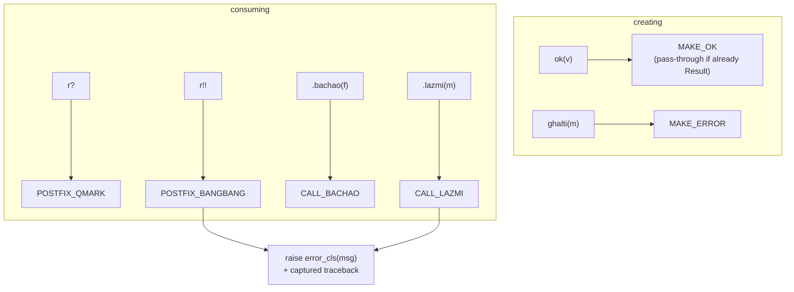

# Results: Errors as Values

<div class="youarehere">📍 <strong>You are here:</strong> Part Five · When Things Go Wrong — 1 of 2</div>

## 🌱 The hook

Some failures are *expected*. Asking for `10 / user_input`, parsing input, hitting a missing dict key — your program should handle these like an adult, not faint. Exceptions make expected failures look like emergencies; returning error codes makes them easy to ignore.

Sindlish takes the third path, borrowed from Rust: **a fallible operation returns a parcel** — either `Ok(value)` or `Ghalti(message)` — and the compiler+VM make sure parcels are handled *deliberately*.

This is the single file for the whole system: creating, inspecting, consuming, propagating, and the bytecode underneath.

## 🧠 Mental model: parcels with delivery receipts

Think of every `/` and `%` as shipping a fragile parcel:

- **Ok(value)** — parcel delivered; value inside.
- **Ghalti(msg)** — parcel bounced; reason attached *and a snapshot of the route it took* (traceback) frozen at bounce time.

A bounced parcel sitting on your doorstep harms no one. You choose: open it hopefully (`?`), demand it opened (`!!`), or sign for a replacement (`bachao`). But you can't *stack* a bounced parcel under other cargo — using an unconsumed Ghalti in further arithmetic raises immediately. Errors demand acknowledgment.

## 🔬 Under the hood

### The parcel itself

```python
# interpreter/objects/core.py:9
class SdResult(SdShey):
    OK = "OK"
    GHALTI = "GHALTI"
    __slots__ = (
        "variant",
        "value",
        "ok",
        "ghalti",
        "_captured_traceback",
        "_error_cls",
    )
```

- `variant` picks the side; `.ok` / `.ghalti` are ready-made booleans for inspection.
- `_error_cls` remembers *which* Sindlish error this would be (`"ZeroVindJeGhalti"`…) so raising later re-creates the right class.
- `_captured_traceback` freezes the call stack at creation time — even if you raise the error 40 lines later, the report shows where it was *born*.

### Making parcels

| Form | Becomes | Verified behavior |
|---|---|---|
| `ok(expr)` | Ok parcel | usually implicit via arithmetic |
| `ghalti("msg")` as expression | Ghalti parcel | |
| `ghalti("msg")` alone as a **statement** | panic! | the one true panic form — aborts immediately with `HalndeVaktGhalti` (verified; previous lines still print first) |

> 🗑️ The old `kharabi(msg)` keyword was removed in the v0.2 refactor. A bare `ghalti(msg)` statement is now the only spelling — and since `kharabi` lexes as a plain identifier, using it dies with `Nalo 'kharabi' na milyo`.

You rarely write these by hand: `/`, `%`, and friends already return Results internally (`objects/numbers.py:43`). Function `wapas` auto-wraps in Ok at the boundary.

### The consumption toolbox — all six moves, all verified

```sd
likh(10 / 0)              # 1 · print without consuming → shows message, lives
r = 10 / 2?               # 2 · soft unwrap   → r holds 5.0; errors pass through
x = (9 / 0)!!             # 3 · panic unwrap   → raises HERE (ZeroVindJeGhalti)
f = (9 / 0).bachao(0)     # 4 · fallback       → f holds 0
m = (9 / 0).lazmi("oops") # 5 · raise w/ msg   → verified: ZeroVindJeGhalti: oops
likh(r.ok)                # 6 · inspect        → sach / koorh booleans
```

| Move | On Ok | On Ghalti | Opcode |
|---|---|---|---|
| print / pass along | untouched | untouched | *(none)* |
| `r?` | push `.value` | push parcel unchanged | `POSTFIX_QMARK` |
| `r!!` | push `.value` | **raise** original class + captured traceback | `POSTFIX_BANGBANG` |
| `.bachao(fb)` | push `.value` | push fallback | `CALL_BACHAO` |
| `.lazmi(msg)` | push `.value` | **raise**, but message replaced, class kept | `CALL_LAZMI` |
| `.ok` / `.ghalti` | `sach` / `koorh` | boolean inspection | `GET_ATTR` |

Note what `lazmi` does *not* do: it doesn't flatten everything to a generic runtime error. The class survives because the parcel carried its own receipt (`_error_cls`) from creation time.

### Raw values count as success

Anywhere a Result is expected but a plain value appears — after boundary unwrapping — inspection treats it as success automatically:

```sd
n = 42
likh(n.ok)      # verified: sach  (no parcel = nothing went wrong)
```

This one rule is why mixed code ("sometimes I get a Result, sometimes not") never needs isinstance-style branching in Sindlish itself.

### Strict consumption

The one hard law:

```sd
x = 9 / 0        # bounced parcel stored, program calm…
likh(x * 2)      # …but USING it in arithmetic raises instantly:
```

```text
ZeroVindJeGhalti: Zero (0) saan vand natho kare saghjay.
Call Stack (most recent call last):
  --> Line 1, in main
    x = 9 / 0
At Location:
   1 | x = 9 / 0
   2 | likh(x * 2)
              ^
```

Every binary operator unwraps operands first (`vm.py:_unwrap_val`); encountering a Ghalti raises with the *creation-site* traceback attached. Silent propagation of garbage is structurally impossible — that's the safety payoff of parcels over error codes.

### Propagation across functions

`?` inside a function lets errors ride outward naturally (verified end-to-end):

```sd
kaam bhag(adad a, adad b) {
    r = a / b?
    wapas r * 10
}
likh(bhag(9, 3))   # 30.0
bhag(9, 0)         # ZeroVindJeGhalti raised at top level,
                   # traceback: main → bhag, pointing at line 2
```

Boundaries cooperate: function returns unwrap Ok (callers see values, not wrappers), parameter binding likewise, and conditions unwrap too. Ghalti parcels are the only Results that survive across a boundary — which keeps the mental model tiny: *"values flow; errors travel until someone consumes them."*

> ⚠️ One logged exception to that story: pushing an Err into an *explicitly typed* variable currently trips the type check (`'RESULT' milyo`) instead of propagating — see `roadmap/TODO.md`. Until fixed, propagate through untyped locals.

## The precedence trap (read twice)

Postfix operators bind tighter than any infix operator — identical to Rust:

```sd
a / b?          # parses as  a / (b?)   ← probably NOT what you meant
(a / b)?        # unwrap the division result
9 / 0.bachao(0) # method called on the literal 0! dies: Nalo 'bachao' na milyo
(9 / 0).bachao(0)  # ✓ what you meant
```

When in doubt, parenthesize the fallible expression before decorating it.

## Underneath: the five opcodes



All handlers live in `interpreter/backend/vm.py:683-731`. Creation-time capture happens in `SdResult.capture_traceback` (`objects/core.py:25`).

<div class="recap">
<p>Fallible ops return Ok/Ghalti parcels; printing or storing them is harmless.</p>
<p>Six moves: <code>? ! ! .ok/.ghalti</code>, <code>.bachao()</code>, <code>.lazmi()</code> — plus strict-consumption law for arithmetic.</p>
<p><code>lazmi</code> swaps the message but keeps the error class; tracebacks freeze at creation.</p>
<p>Raw values = success everywhere; boundaries auto-unwrap Ok.</p>
<p>Postfix binds tight — parenthesize <code>(a/b)?</code>.</p>
</div>
