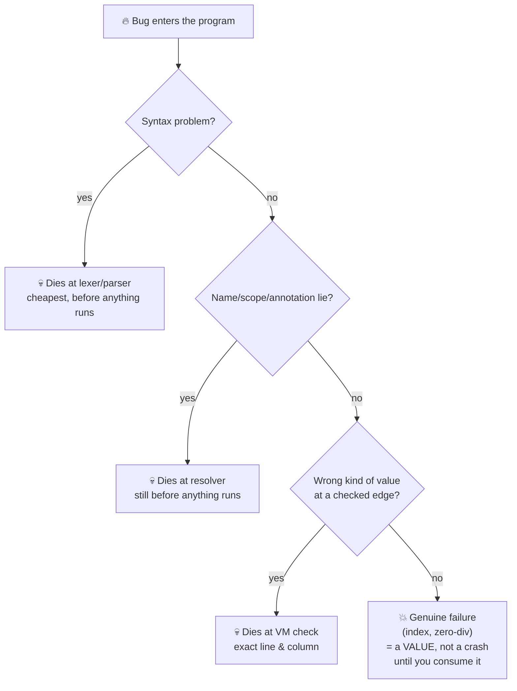

# Safety: What Sindlish Promises You

<div class="youarehere">📍 <strong>You are here:</strong> Part Four · Safety</div>

## 🌱 The hook

"Safety" in language design sounds abstract. It isn't. It answers one question:

> *When something goes wrong, how early do you find out — and how loud is it?*

Sindlish's answer is a ladder. Every rung is a moment where a bug can die, ordered from cheapest to most expensive. This chapter walks the whole ladder in plain terms, then gives you the enforcement map you'll use when hacking on the interpreter.

## 🧠 Mental model: the smoke-alarm principle

A good house has smoke alarms in every room — not one giant siren at the end of the night. Sindlish's pipeline *is* that alarm system: each stage checks what it can cheaply, and hands survivors to the next, stricter stage. A typo never reaches runtime; a missing list element can't be caught any earlier than the moment it happens.



Now each promise in detail.

## Promise 1 · Nothing crashes quietly

Every failure path ends in a `SindhiBaseError` with **file position and source text attached** — rendered as the caret display you've seen throughout this book. Python exceptions leaking to users are treated as interpreter bugs: `call_method` (`objects/base.py:249`) maps `TypeError → QisamJeGhalti`, `IndexError → IndexJeGhalti`, `ZeroDivisionError → ZeroVindJeGhalti`, everything else → `HalndeVaktGhalti`. Verified example of the worst ordinary accident — an out-of-bounds index:

```text
QisamJeGhalti: Fehrist jo index 10 hadd khaan bahar aahe.
Call Stack (most recent call last):
  --> Line 2, in main
    likh(l[10])
At Location:
   1 | fehrist[adad] l = [1,2,3]
   2 | likh(l[10])
           ^
```

No stack dumps, no hex addresses. Same for missing dict keys: `Key 'z' Lughat mein na mili.`

## Promise 2 · Recoverable errors are values, not surprises

The division you *expected* to fail shouldn't nuke your program. So arithmetic that can fail (`/`, `%`) returns a **Result** — `Ok(value)` or `Ghalti(message)` — and Results are inert until consumed ([full chapter](results.md)):

```sd
likh(10 / 0)              # verified: prints the error MESSAGE, program lives
r = 9 / 3?                # soft unwrap: value flows, errors keep flowing past
x = (9 / 0)!!             # panic unwrap: raise HERE, with captured traceback
fallback = (9 / 0).bachao(0)   # ✓ verified: fallback wins, program lives
```

Two verified subtleties worth tattooing somewhere visible:

1. **Postfix binds tight.** `a / b?` means `a / (b?)`, exactly like Rust's `a / b?`. Wrap the whole expression when you mean it: `(a / b)?`. Even `.method()` binds to the literal: un-parenthesized `9 / 0.bachao(0)` dies with `Nalo 'bachao' na milyo` because it calls a method on the *number 0*.
2. **Errors must stay consumable across typed boundaries** — currently storing an Err into an annotated variable misfires (bug logged in `roadmap/TODO.md`). Until fixed, propagate through untyped locals.

## Promise 3 · Bindings say what they mean

Three mechanisms, three different guarantees:

- **`pakko` constants** — once assigned, rebinding raises `'PI' pakko (const) aahe, eho badli natho saghjay.` Enforced for globals *and* function locals (via per-function slot metadata).
- **Type annotations** — checked twice (resolve-time + every store), per [Part Three](typing-model.md). They're opt-in: dynamic code stays dynamic.
- **Closure write discipline** — assigning into an enclosing function's variable without `bahari` is rejected at resolve time with instructions, killing the classic "why did my counter reset?" bug class before it exists.

## Promise 4 · Collections defend their borders

| Accident | Result |
|---|---|
| `l[99]` / `s[99]` | clean bounds error naming the bad index |
| `l[-1]` | allowed — negative indexing from the end |
| `d["missing"]` | `Key … na mili.` (use `.hasil(key, default)` for the gentle version) |
| `{[1,2]}` — unhashable set member | `QisamJeghalti` at build time, mapped from raw TypeError |
| `nums.wadha("str")` into `fehrist[adad]` | ⚠️ passes today — element pushes aren't re-checked yet |

That last row is the honest hole in the fence, logged and waiting for a contributor.

## Promise 5 · Truthiness can't blow up the VM

Conditions used to crash when fed dicts or sets. Now every condition, loop guard, and logical operator routes through one helper, `sd_truthy()` (`objects/base.py:163`): containers are true when non-empty, Results unwrap success / treat errors as truthy (an error is information!), and nothing raises. One definition, zero special cases in the VM.

## The enforcement map

Where each promise physically lives — your cheat sheet for future work:

| Guarantee | Checked at | Source anchor |
|---|---|---|
| syntax sanity | lexer/parser | `frontend/lexer.py`, `frontend/parser.py` |
| names exist, annotations honest, closure writes declared | resolver walk | `analysis/resolver.py:104,136,294,415` |
| const/type on globals | every store | `backend/vm.py:_op_store_global` |
| const/type on locals | every store | `backend/vm.py:_op_store_fast` |
| param/return types | call boundaries | `backend/vm.py:_call_sd_function`, `_op_return_value` |
| errors-as-values | arithmetic + Result opcodes | `objects/numbers.py:43`, `vm.py:683-731` |
| exception laundering | dispatch boundary | `objects/base.py:call_method` |
| pretty reports | final render | `errors.py:ErrorReporter.report` |
| safe truthiness | all jumps/logic | `objects/base.py:sd_truthy` |

<div class="recap">
<p>Safety = alarms on a ladder: syntax → resolution → runtime edges → values.</p>
<p>Recoverable failures arrive as Ok/Ghalti VALUES; postfix binds tight, so parenthesize <code>(a/b)?</code>.</p>
<p><code>pakko</code>, annotations, and <code>bahari</code> give bindings meaning; collections check borders.</p>
<p>Known holes (element-push checks, Err-through-typed-slots) are logged in roadmap/TODO.md.</p>
</div>
