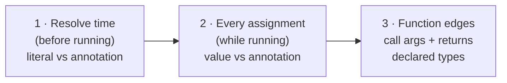

# Hybrid Typing: The Mental Model

<div class="youarehere">📍 <strong>You are here:</strong> Part Three · Hybrid Typing — 1 of 2</div>

## 🌱 The hook

Most languages force a philosophy on you. Python says *"relax, figure it out at runtime."* Rust says *"prove everything before you run."* Sindlish refuses to choose. Its rule is:

> **Dynamic by default. Static the moment you ask for it.**

This chapter builds the intuition; [the next one](typing-rules.md) goes line-by-line through every check, matrix and edge case.

## 🧠 Mental model: seatbelts that only clip when you buckle them

Every variable in Sindlish is dynamically typed underneath — it holds an `SdShey`, and you can rebind `x` from `5` to `"five"` without ceremony… **unless** you asked for a seatbelt at declaration:

```sd
x = 5              # no belt: x may become anything, anytime
adad y = 5         # belt clipped: y is now checked as adad (int)
lafz name = "ali"  # name is checked as lafz
fehrist[adad] nums = [1, 2, 3]   # belt for the container AND its contents
```

Once buckled, three things happen — each enforced at a different moment of the program's life:



That's why we call it *hybrid*: the same file can hold free-wheeling dynamic code and strictly-checked code, line by line, with zero global configuration.

## 🔬 Under the hood

### What "asking" looks like — all six declaration styles

The parser folds these into one `AssignNode` with flags; the resolver treats `has_explicit_type=True` as "seatbelt requested":

| # | Style | Example | Belt? |
|---|---|---|---|
| 1 | bare | `x = 5` | none |
| 2 | type-first | `adad x = 5` | ✓ scalar |
| 3 | postfix annotation | `x: adad = 5` | ✓ scalar |
| 4 | typed collection | `fehrist[adad] nums = [1,2]` | ✓ element-wise |
| 5 | typed dict | `lughat[lafz, adad] ages = {"a": 1}` | ✓ keys AND values |
| 6 | constant | `pakko PI = 3.14` | ✓ immutability |

Styles 2–6 also give you **free initialization**: `adad n` alone means `n = 0`, `lafz s` means `s = ""`, collections start empty. Constants are the exception — a `pakko` without a value is rejected by the parser, because a constant must be born holding its value.

### The two-layer check, precisely

**Layer 1 — resolve time.** If your annotated right side is something whose type can be *proven* from the text alone (a literal, or a variable whose slot already has known metadata), the resolver compares immediately (`resolver.py:_verify_assignment_types`) and raises before a single instruction runs:

```sd
lafz name = 42
```

```text
QisamJeGhalti: Qisam natho mile: lafz khapyo paye, par adad milyo.
```

Notice there's no call stack in that error — nothing was executing. This is the cheapest possible failure, which is exactly where we want typos to die.

**Layer 2 — runtime assignments.** For anything unprovable statically (function results, user input), the annotation travels to the VM inside slot/global metadata, and *every future store* to that name gets checked (`vm.py:_op_store_fast` / `_op_store_global`):

```sd
dahai d = 10 / 2     # division yields Ok(5.0); boundary unwraps → 5.0 fits dahai ✓
adad x = 10 / 2      # 5.0 does NOT fit adad → verified error:
```

```text
QisamJeGhalti: 'adad' qisam laai adad khapyo paye, par 'DAHAI' milyo.
```

One subtle beauty here: `/` always produces a Result internally ([results.md](results.md)), but assignment is a *consumption boundary* — success values get unwrapped automatically, so annotations interact with Results gracefully while still refusing genuine mismatches.

### Functions: belts at the doors

Annotations on parameters and return types are checked exactly where values enter or leave:

```sd
kaam salam(lafz naam, adad umar) {
    likh("salam", naam, umar)
}
kaam jor(a, b) -> adad {
    wapas a + b
}
salam("ali", 30)   # verified: prints "salam ali 30"
jor(1, 2)          # verified: fine, returns 3
```

Hand a `lafz` where `adad` is declared, or return the wrong kind from a `-> adad` function, and the VM raises at the boundary — with the function's own name in the message. Bodies themselves stay dynamic: you annotate the *edges*, not every breath inside.

### What hybrid typing is NOT

Honest boundaries matter as much as features:

- **No inference beyond literals/known slots.** `adad x = 5 + 3` passes silently because `+` results aren't statically provable yet — the check simply defers to runtime.
- **No union types**, no generics, no user-defined types yet (classes are on the roadmap).
- **Unannotated code is never checked.** A belt you don't buckle provides zero protection.
- Element checks fire on *declaration literals*, not on later `.wadha()` pushes — `nums.wadha("oops")` into a `fehrist[adad]` sails through today. (A natural place to contribute!)

<div class="recap">
<p>Hybrid = dynamic everywhere, static wherever you annotate.</p>
<p>Layer 1 checks provable cases at resolve time (no call stack in the error).<br>Layer 2 checks every runtime store against recorded metadata.</p>
<p>Six declaration styles, incl. element-typed collections & dicts; missing initializers become zero values.</p>
<p>Function parameter/return annotations are checked at the call boundary.</p>
</div>
