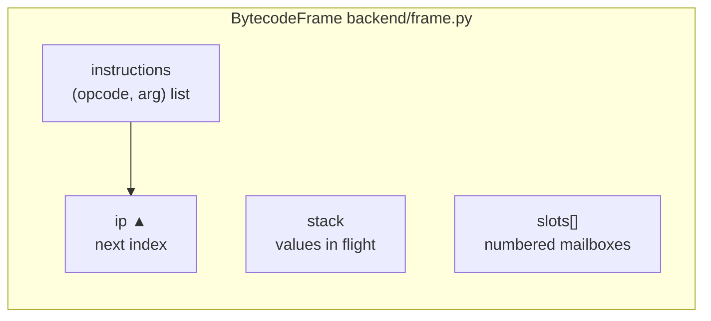

# The Stack VM From Zero

<div class="youarehere">📍 <strong>You are here:</strong> Part Seven · The Engine Room — 2 of 4</div>

## 🌱 The hook

Everything before this stage is preparation. This is where Sindlish actually *runs*: `interpreter/backend/vm.py` (~880 lines), a stack-based virtual machine. "Stack-based" means every instruction either puts values on a stack, takes them off, or rearranges them. No registers, no addresses — just a spring-loaded plate stack.

This chapter makes you fluent in reading execution by hand: three real programs, traced instruction-by-instruction with the actual bytecode the compiler emits (dumped from the real interpreter during this book's writing).

## 🧠 Mental model: plates and an arrow

The VM state per frame:



One loop drives it all (`VM.run → step`, `vm.py:206-255`): fetch `(opcode, arg)` at `ip`, bump `ip`, call the opcode's handler from `dispatch_table`. Handlers are tiny methods that push/pop and delegate behavior to values themselves.

## 🔬 Under the hood

### Trace 1 · Arithmetic & precedence

```sd
adad x = 3 + 4 * 2
```

| ip | instruction | arg | stack after | notes |
|--:|---|--:|---|---|
| 0 | `LOAD_CONST` | 0 | `[3]` | const pool hit |
| 1 | `LOAD_CONST` | 1 | `[3, 4]` | |
| 2 | `LOAD_CONST` | 2 | `[3, 4, 2]` | |
| 3 | `BINARY_MUL` | – | `[3, 8]` | pop 4,2 → push 8 |
| 4 | `BINARY_ADD` | – | `[11]` | pop 3,8 → push 11 |
| 5 | `STORE_GLOBAL` | x-info | `[]` | checked store; type=ADAD recorded |
| 6 | `HALT` | – | `[]` | |

Two things to notice forever:

- **Order of operands**: `BINARY_MUL` pops right first, then left. Handlers are careful to pop `right` then `left`.
- **Arithmetic returns Results internally** — `_binary_op_result` wraps success as Ok. Assignment/conditions unwrap at boundaries, so this trace shows plain numbers.

### Trace 2 · Branching

```sd
agar 5 > 3 {
    likh(1)
} warna {
    likh(2)
}
```

```text
 0 LOAD_CONST 5      3 JUMP_IF_FALSE → 8     6 POP_TOP            9 CALL_FUNCTION likh
 1 LOAD_CONST 3      4 LOAD_CONST 1          7 JUMP_ABSOLUTE →11 10 POP_TOP
 2 COMPARE_GT        5 CALL_FUNCTION likh    8 LOAD_CONST 2      11 HALT
```

Execution path when truthy: 0→1→2→3 (no jump)→4→5 prints →6 pops →7 **jumps over the else** →11 halt. When falsy, step 3 teleports `ip` to 8. The condition value is *consumed* by `JUMP_IF_FALSE` — conditions don't leave litter on the stack.

### Trace 3 · The loop heartbeat

```sd
adad n = 2
jistain n > 0 {
    likh(n)
    n = n - 1
}
```

```text
 0 LOAD_CONST 2   1 STORE_GLOBAL n       ← init
 2 LOAD_GLOBAL n  3 LOAD_CONST 0         ← loop top (target!)
 4 COMPARE_GT     5 JUMP_IF_FALSE →14    ← exit ramp
 6 LOAD_GLOBAL n  7 CALL_FUNCTION likh   8 POP_TOP
 9 LOAD_GLOBAL n 10 LOAD_CONST 1
11 BINARY_SUB    12 STORE_GLOBAL n
13 JUMP_ABSOLUTE →2                     ← heartbeat back to top
14 HALT
```

Run it mentally once: n=2 prints 2, becomes 1; prints 1, becomes 0; comparison fails → jump 14. Backward jumps are what make loops loops — everything else you already know from traces 1–2.

### Where locals differ from globals

Top-level code stores through `STORE_GLOBAL` (globals environment dict, carrying `(name, is_const, type, elem_type)` for enforcement). Inside functions the same source compiles to `STORE_FAST slot#` / `LOAD_FAST slot#` — pure array reads on the frame, no names involved. Closure variables use `LOAD_DEREF/STORE_DEREF` against shared cells. Three storage tiers, one rule each:

| Tier | Opcode pair | Storage | Cost |
|---|---|---|---|
| local | FAST | `frame.slots[i]` | O(1) array |
| global | GLOBAL | `Environment.records` dict | hash lookup + checks |
| cell | DEREF | shared `Cell.value` | one indirection |

<div class="recap">
<p>Fetch-bump-dispatch; handlers push/pop and delegate to values.</p>
<p>Binary ops pop right-then-left; arithmetic wraps results internally.</p>
<p><code>JUMP_IF_FALSE</code> consumes its condition; else-chains are forward patches.</p>
<p>Loops = backward jump to a remembered top.</p>
<p>FAST/GLOBAL/DEREF are the three storage tiers.</p>
</div>
