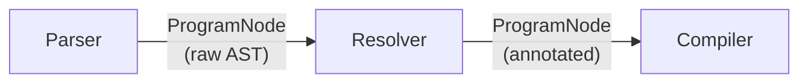
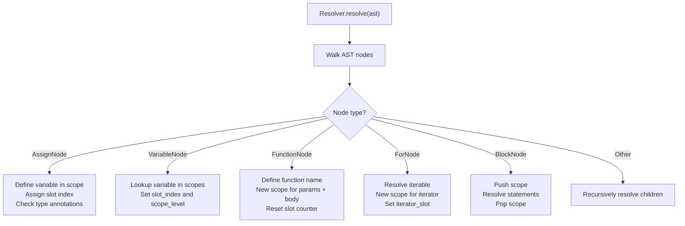
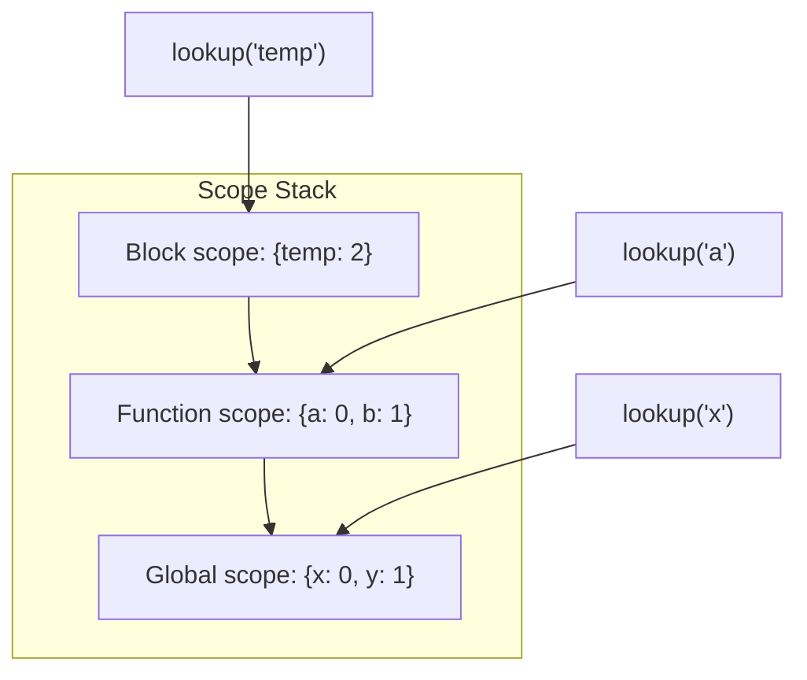
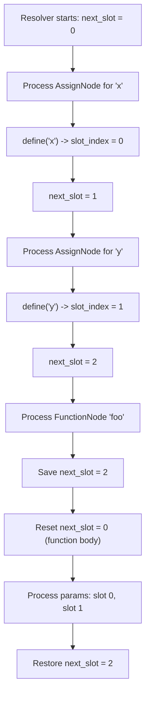
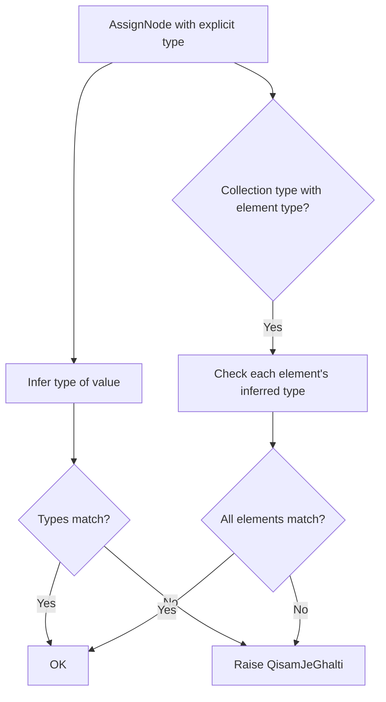
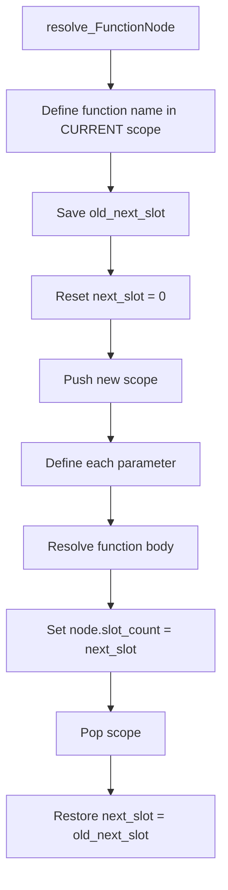

# Analysis: The Resolver

The Resolver (`interpreter/analysis/resolver.py`, ~291 lines) is the semantic analysis pass that runs between parsing and compilation. It annotates the AST with slot indices, scope levels, and type information that the Compiler and VM need for efficient execution.

## Position in the Pipeline



The Resolver mutates the AST in-place, adding `slot_index`, `scope_level`, and `slot_count` fields to variable and assignment nodes.

## What the Resolver Does



## Scope Management

The Resolver maintains a stack of scopes, where each scope is a dict mapping variable names to slot indices.

### Data Structures

```python
class Resolver:
    def __init__(self, code):
        self.code = code
        self.scopes = [{}]          # Stack of {name: slot_index} dicts
        self.next_slot = 0          # Next available slot index
        self.slot_metadata = {}     # {slot_index: metadata_dict}
        self.symbols = []           # For LSP integration
        self.is_repl = False        # True when running in REPL mode
```

### Scope Operations

| Method | Description |
|--------|-------------|
| `push_scope()` | Appends empty dict to `self.scopes` |
| `pop_scope()` | Pops last dict from `self.scopes` |
| `define(name)` | Adds name to current scope with next slot index |
| `lookup(name)` | Walks scopes in reverse, returns slot index or None |

### Lexical Scoping



When looking up a variable, the Resolver walks scopes from innermost to outermost. If a name is not found in any local scope, it gets `scope_level = 1` (global).

## Slot Allocation

Each variable gets an integer **slot index** for O(1) array-based access in the VM. This is the same approach CPython uses for local variables.

### How Slots Are Assigned



### Scope Levels

| Scope Level | Access Method | Storage |
|-------------|---------------|---------|
| 0 (local) | `LOAD_FAST` / `STORE_FAST` | `frame.slots[i]` (array) |
| 1 (global) | `LOAD_GLOBAL` / `STORE_GLOBAL` | `globals.records[name]` (dict) |

The Resolver sets `scope_level = 0` for variables found in any local scope, and `scope_level = 1` for variables not found anywhere (assumed global).

### After Resolution

Every `AssignNode` and `VariableNode` has:
- `slot_index`: integer index into the frame's slot array (or -1 for globals)
- `scope_level`: 0 for local, 1 for global

`ProgramNode.slot_count` is set to `next_slot`, telling the VM how many slots to allocate.

## Type Inference

The Resolver infers types for literal expressions to enable type checking:

```python
def infer_type(self, node):
    if isinstance(node, NumberNode):
        return ADAD if isinstance(node.value, int) else DAHAI
    elif isinstance(node, StringNode):
        return LAFZ
    elif isinstance(node, BoolNode):
        return FAISLO
    elif isinstance(node, NullNode):
        return KHALI
    elif isinstance(node, ListNode):
        return FEHRIST
    elif isinstance(node, DictNode):
        return LUGHAT
    elif isinstance(node, SetNode):
        return MAJMUO
    elif isinstance(node, VariableNode):
        # Look up stored type from slot metadata
        ...
```

## Type Checking

When a variable has an explicit type annotation, the Resolver verifies that the assigned value's inferred type matches:

### `_verify_assignment_types(node)`



For example:
```
fehrist[adad] x = [1, 2, 3]    # OK - all elements are ADAD
fehrist[adad] x = [1, "hi", 3]  # Error - "hi" is LAFZ, not ADAD
```

### Type Check Matrix

| Declared Type | Expected Value Type | Element Check |
|---------------|---------------------|---------------|
| `ADAD` | `NumberNode` (int) | -- |
| `DAHAI` | `NumberNode` (float) | -- |
| `LAFZ` | `StringNode` | -- |
| `FAISLO` | `BoolNode` | -- |
| `FEHRIST` | `ListNode` | Each element's type |
| `LUGHAT` | `DictNode` | Key and value types |
| `MAJMUO` | `SetNode` | Each element's type |
| `KHALI` | `NullNode` | -- |

## Function Resolution



Key points:
- The function name is defined in the **enclosing** scope (not the function's own scope)
- The slot counter is saved and restored, so function-local variables don't interfere with the enclosing scope
- Each parameter gets its own slot starting from 0

## For-Loop Resolution

```python
def resolve_ForNode(self, node):
    self.resolve(node.iterable)        # Resolve the iterable expression
    self.push_scope()                  # New scope for iterator
    slot = self.define(node.iterator)  # Define iterator variable
    node.iterator_slot = slot          # Store slot in AST node
    self.resolve(node.body)            # Resolve loop body
    self.pop_scope()                   # Pop iterator scope
```

## Symbol Tracking for LSP

The Resolver records all defined symbols with metadata:

```python
self.symbols.append({
    "name": name,
    "type": inferred_type,
    "line": line,
    "col": col,
    "kind": "variable" | "function"
})
```

This data is used by the VS Code extension's Language Server for completions and hover information.

## REPL Mode

When `resolver.is_repl = True`, variables defined at the top level get `scope_level = 1` (global) and `slot_index = -1`, ensuring they persist across REPL lines.

```python
def resolve_AssignNode(self, node):
    ...
    if self.is_repl and len(self.scopes) == 1:
        # Top-level in REPL mode -> global
        node.scope_level = 1
        node.slot_index = -1
    else:
        # Normal local variable
        node.slot_index = self.define(node.name, node)
        node.scope_level = 0
```
