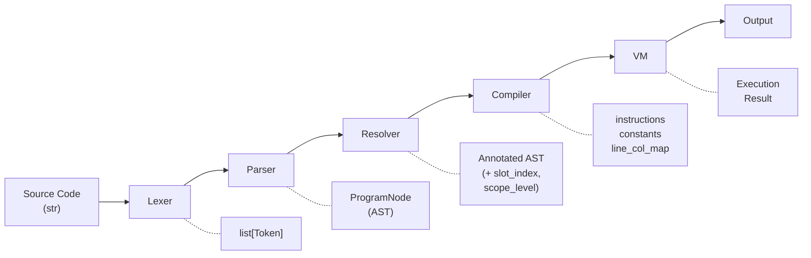
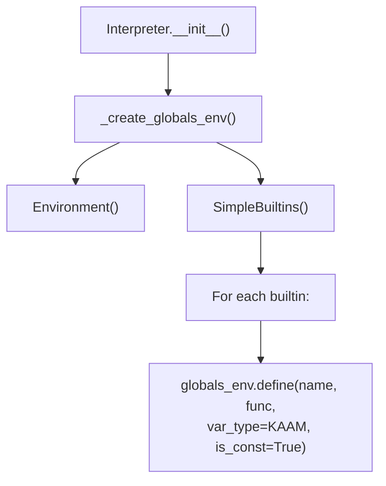
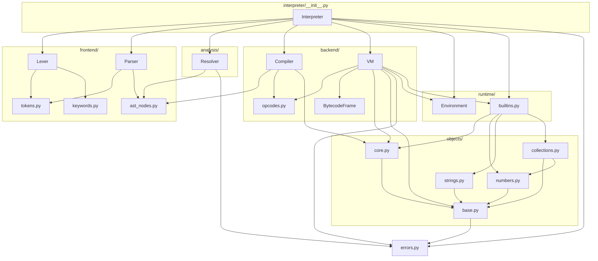
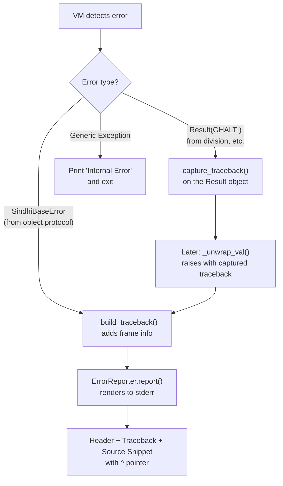

# Architecture

This document describes the high-level architecture of the Sindlish interpreter, the data flow between subsystems, and how the major components fit together.

## The Pipeline

The Sindlish interpreter follows a classic 5-stage pipeline, orchestrated by the `Interpreter` facade class in `interpreter/__init__.py`:



Each stage transforms the data into a more refined representation:

| Stage | Input | Output | File |
|-------|-------|--------|------|
| **Lexer** | Source code string | `list[Token]` | `frontend/lexer.py` |
| **Parser** | `list[Token]` | `ProgramNode` (AST) | `frontend/parser.py` |
| **Resolver** | `ProgramNode` | Annotated AST (slots + types) | `analysis/resolver.py` |
| **Compiler** | Annotated AST | `(instructions, constants, line_col_map)` | `backend/compiler.py` |
| **VM** | Bytecode + globals | Execution output | `backend/vm.py` |

## The Interpreter Facade

The `Interpreter` class (`interpreter/__init__.py:26`) is the public API. It encapsulates the entire pipeline:

```python
class Interpreter:
    def __init__(self):
        self._globals_env = self._create_globals_env()

    def run_source(self, code: str, is_repl: bool = False) -> VM:
        # 1. Lex
        tokens = Lexer(code).generate_tokens()
        # 2. Parse
        ast = Parser(tokens, code).parse()
        # 3. Resolve
        resolver = Resolver(code)
        if is_repl:
            resolver.is_repl = True
        resolver.resolve(ast)
        # 4. Compile
        instructions, constants, line_col_map = Compiler(code).compile(ast)
        # 5. Execute
        vm = VM(code, instructions, constants, self._globals_env,
                ast.slot_count, resolver.slot_metadata, line_col_map)
        vm.run()
        return vm
```

### Initialization

On construction, `Interpreter._create_globals_env()` creates a global `Environment` and populates it with all 5 built-in functions from `SimpleBuiltins`:



### Error Handling

The pipeline wraps all stages in try/except:

```
try:
    pipeline stages...
except SindhiBaseError as e:
    ErrorReporter.report(e)
    if not is_repl: sys.exit(1)
    else: raise
except Exception as e:
    print(f"Internal Error: {e}")
    if not is_repl: sys.exit(1)
    else: raise
```

## Module Dependencies



## Data Flow Example

Here is a complete trace of how the following Sindlish code flows through the pipeline:

### 1. Source Code

```
adad x = 5
likh(x + 3)
```

### 2. Lexer Output

The Lexer scans character-by-character and produces:

```
Token(ADAD, 'adad')
Token(IDENTIFIER, 'x')
Token(EQ, '=')
Token(ADAD, 5)
Token(NEWLINE, '\n')
Token(LIKH, 'likh')
Token(LPAREN, '(')
Token(IDENTIFIER, 'x')
Token(PLUS, '+')
Token(ADAD, 3)
Token(RPAREN, ')')
Token(EOF, None)
```

### 3. Parser Output (AST)

The Parser produces a `ProgramNode` containing two statements:

```
ProgramNode([
  AssignNode(
    name='x',
    value=NumberNode(5),
    type=ADAD,
    is_const=False,
    element_type=None,
    has_explicit_type=True
  ),
  PrintNode(
    value=BinaryOpNode(
      left=VariableNode('x'),
      op=PLUS,
      right=NumberNode(3)
    )
  )
])
```

### 4. Resolver Output

The Resolver walks the AST and annotates each node:

- `AssignNode` for `x`: `slot_index=0`, `scope_level=0`
- `VariableNode('x')` in the print: `slot_index=0`, `scope_level=0`
- `ProgramNode.slot_count = 1`

After resolution, the AST carries all the slot and scope information the Compiler needs.

### 5. Compiler Output

The Compiler translates the annotated AST into bytecode:

```
Instructions:
  0: LOAD_CONST 0       # SdNumber(5)
  1: STORE_FAST 0       # x = 5
  2: LOAD_FAST 0        # load x
  3: LOAD_CONST 1       # SdNumber(3)
  4: BINARY_ADD         # x + 3
  5: PRINT_ITEM         # likh(result)
  6: HALT

Constants: [SdNumber(5), SdNumber(3)]
```

### 6. VM Execution

The VM creates a `BytecodeFrame` with 1 slot and executes the instructions:

1. `LOAD_CONST 0` — push `SdNumber(5)` onto the stack
2. `STORE_FAST 0` — pop `SdNumber(5)`, store in `frame.slots[0]`
3. `LOAD_FAST 0` — push `frame.slots[0]` (SdNumber(5)) onto the stack
4. `LOAD_CONST 1` — push `SdNumber(3)` onto the stack
5. `BINARY_ADD` — pop both, call `SdNumber.__add__()`, push `SdNumber(8)`
6. `PRINT_ITEM` — pop `SdNumber(8)`, print `8`
7. `HALT` — stop

**Output:** `8`

## Error Flow



## Key Design Decisions

### 1. Bytecode VM (not AST walker)
The interpreter compiles to bytecode and executes in a stack-based VM rather than walking the AST. This enables:
- O(1) local variable access via slots
- Efficient instruction dispatch via a table
- Potential for future JIT compilation

### 2. Slot-Based Local Variables
Variables at scope level 0 use array-indexed slots (`frame.slots[i]`) for O(1) access. This is the same approach as CPython. Global variables use dictionary lookup.

### 3. Result Type System
Instead of exceptions for recoverable errors, Sindlish uses a Result monad (`SdResult` with OK/GHALTI variants). This allows safe error propagation with `.bachao()` (fallback), `.lazmi()` (re-raise), `?` (soft unwrap), and `!!` (panic unwrap).

### 4. Protocol-Based Dispatch
All operations (+, -, *, ==, etc.) are dispatched through `SdShey.call_method()`, which checks Python dunder methods first, then falls back to MRO-based method lookup. This makes the object system extensible.

### 5. C3 Linearization MRO
The `SdType` metaclass uses C3 linearization (same as Python) for method resolution order, enabling proper multiple inheritance.

### 6. Reference Counting
Objects use reference counting (`incref`/`decref`/`_dealloc`) for memory management. This is a simplified version of CPython's approach.
