# Backend: Compiler, Opcodes, and Virtual Machine

The backend compiles the annotated AST into bytecode and executes it in a stack-based virtual machine. It consists of four components: the **Compiler** (AST to bytecode), the **OpCode definitions**, the **BytecodeFrame** (execution frame), and the **VM** (executor).

## Pipeline

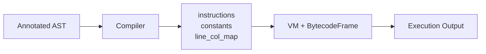

---

## Opcodes (`interpreter/backend/opcodes.py`)

The `OpCode` IntEnum defines 50 bytecode instructions organized into 12 categories.

### Complete Opcode Reference

#### Constants and Variables (7)

| Opcode | Arg | Description |
|--------|-----|-------------|
| `LOAD_CONST` | const_index | Push `constants[arg]` onto stack |
| `LOAD_FAST` | slot_index | Push `frame.slots[arg]` (O(1) local access) |
| `STORE_FAST` | slot_index | Pop value, store in `frame.slots[arg]` (enforces pakko + types) |
| `LOAD_GLOBAL` | name_index | Look up `constants[arg].value` in globals, push value |
| `STORE_GLOBAL` | name_index or tuple | Pop value, store in globals; tuple carries `(idx, is_const, type, elem)` enforcement |
| `LOAD_DEREF` | cell_index | Push closure cell `frame.cells[arg].value` |
| `STORE_DEREF` | cell_index | Pop value, store in closure cell `frame.cells[arg].value` |

#### Primitive Values (3)

| Opcode | Arg | Description |
|--------|-----|-------------|
| `PUSH_NULL` | -- | Push `SdNull()` |
| `PUSH_TRUE` | -- | Push `SdBool(True)` |
| `PUSH_FALSE` | -- | Push `SdBool(False)` |

#### Arithmetic (6)

| Opcode | Arg | Description | Protocol Method |
|--------|-----|-------------|-----------------|
| `BINARY_ADD` | -- | Pop right, left, push `left + right` | `__add__` |
| `BINARY_SUB` | -- | Pop right, left, push `left - right` | `__sub__` |
| `BINARY_MUL` | -- | Pop right, left, push `left * right` | `__mul__` |
| `BINARY_DIV` | -- | Pop right, left, push `left / right` | `__truediv__` |
| `BINARY_POW` | -- | Pop right, left, push `left ^ right` | `__pow__` |
| `BINARY_MOD` | -- | Pop right, left, push `left % right` | `__mod__` |

#### Comparisons (6)

| Opcode | Arg | Description | Protocol Method |
|--------|-----|-------------|-----------------|
| `COMPARE_EQ` | -- | `left == right` | `__eq__` |
| `COMPARE_NE` | -- | `left != right` | `__ne__` |
| `COMPARE_LT` | -- | `left < right` | `__lt__` |
| `COMPARE_LE` | -- | `left <= right` | `__le__` |
| `COMPARE_GT` | -- | `left > right` | `__gt__` |
| `COMPARE_GE` | -- | `left >= right` | `__ge__` |

#### Logical (1)

| Opcode | Arg | Description |
|--------|-----|-------------|
| `LOGICAL_NOT` | -- | `nah value`; push truthy negation via `sd_truthy` |

#### Stack Manipulation (1)

| Opcode | Arg | Description |
|--------|-----|-------------|
| `POP_TOP` | -- | Pop and discard top of stack |

#### Control Flow (4)

| Opcode | Arg | Description |
|--------|-----|-------------|
| `JUMP_ABSOLUTE` | address | Set `frame.ip = arg` |
| `JUMP_IF_FALSE` | address | Pop condition; if falsy, jump to `arg` |
| `JUMP_IF_FALSE_OR_POP` | address | Peek condition; if true pop it, else jump to `arg` (short-circuit `aen`) |
| `JUMP_IF_TRUE_OR_POP` | address | Peek condition; if false pop it, else jump to `arg` (short-circuit `ya`) |

#### Iteration (2)

| Opcode | Arg | Description |
|--------|-----|-------------|
| `GET_ITER` | -- | Pop object, push `iter(obj)` |
| `FOR_ITER` | exit_addr | Peek iterator, call `next()`. On `StopIteration`, pop iterator and jump to `arg`. |

#### Collections (5)

| Opcode | Arg | Description |
|--------|-----|-------------|
| `BUILD_LIST` | count | Pop `arg` items, create `SdList` |
| `BUILD_DICT` | count | Pop `arg * 2` items (key-value pairs), create `SdDict` |
| `BUILD_SET` | count | Pop `arg` items, create `SdSet` |
| `BINARY_SUBSCRIPT` | -- | Pop index, obj, push `obj[index]` |
| `STORE_SUBSCRIPT` | -- | Pop value, index, obj, call `obj[index] = value` |

#### Functions and Methods (5)

| Opcode | Arg | Description |
|--------|-----|-------------|
| `CALL_FUNCTION` | `(const_idx, num_args, has_markers)` | Call global function by name |
| `CALL_VALUE` | `(num_args, has_markers)` | Call a function value already on the stack (`f()()`, local callees) |
| `CALL_METHOD` | `(const_idx, num_args, has_markers)` | Call method on object (MRO lookup) |
| `GET_ATTR` | const_index | Get attribute (only `ok`/`ghalti` exist today) |
| `MAKE_FUNCTION` | ndefaults | Turn an `SdFunction` constant into a callable, binding defaults and closure cells |

#### Result System and Errors (8)

| Opcode | Arg | Description |
|--------|-----|-------------|
| `MAKE_OK` | -- | Wrap top in `SdResult(OK, value)` |
| `MAKE_ERROR` | -- | Wrap top in `SdResult(GHALTI, value)` |
| `CALL_BACHAO` | -- | Pop fallback, result; return value if OK, fallback if GHATLI |
| `CALL_LAZMI` | -- | Pop message, result; return value if OK, raise if GHALTI |
| `POSTFIX_QMARK` | -- | Pop result; unwrap if OK, pass through if GHALTI |
| `POSTFIX_BANGBANG` | -- | Pop result; unwrap if OK, panic if GHALTI |
| `PANIC` | -- | Pop message, raise `HalndeVaktGhalti` |
| `TYPECAST` | -- | Pop value, convert to target type |

#### Completion (2)

| Opcode | Arg | Description |
|--------|-----|-------------|
| `RETURN_VALUE` | -- | Pop value, pop frame, push value to caller |
| `HALT` | -- | Stop VM execution |

---

## Compiler (`interpreter/backend/compiler.py`)

The Compiler (~407 lines) is a tree-walking compiler that translates AST nodes into `(opcode, arg)` instruction tuples.

### Data Structures

```python
class Compiler:
    def __init__(self, code):
        self.code = code
        self.instructions = []  # List of (opcode, arg) tuples
        self.constants = []  # Constant pool
        self.line_col_map = {}  # instruction_index -> (line, column)
        self.loop_stack = []  # Stack for break/continue patching
```

### Core Methods

#### `emit(opcode, arg, node) -> int`

Appends `(opcode, arg)` to the instruction list. If `node` is provided, records the source position in `line_col_map`. Returns the instruction index.

#### `add_const(value) -> int`

Adds a value to the constant pool. Deduplicates by content equality (handles `SdShey` objects via `.value` comparison). Returns the index.

#### `compile(node) -> (instructions, constants, line_col_map)`

Dispatch method: calls `self.compile_{type(node).__name__}(node)`. The entry point compiles `ProgramNode`, which compiles all statements and emits `HALT`.

### Compilation Strategies

#### Literal Nodes

| Node | Compilation |
|------|-------------|
| `NumberNode(5)` | `LOAD_CONST` (adds `SdNumber(5)` to constants) |
| `StringNode("hi")` | `LOAD_CONST` (adds `SdString("hi")` to constants) |
| `BoolNode(True)` | `PUSH_TRUE` |
| `BoolNode(False)` | `PUSH_FALSE` |
| `NullNode()` | `PUSH_NULL` |

#### Variable Access

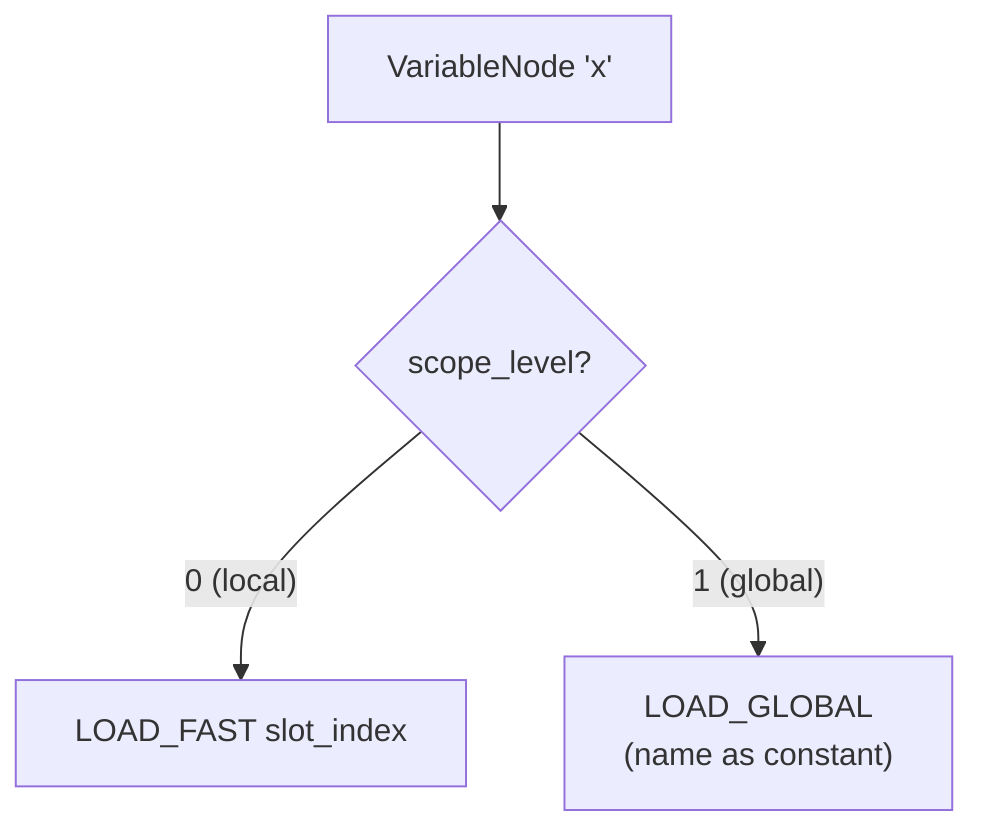

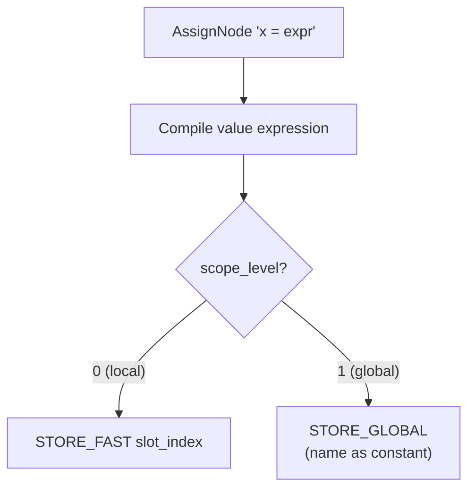

#### Binary Operations

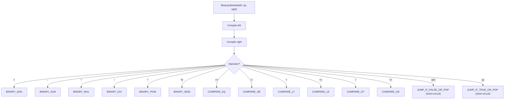

#### Unary Operations

- **`nah expr`**: compile expr, emit `LOGICAL_NOT`
- **`-expr`**: emit `LOAD_CONST 0`, compile expr, emit `BINARY_SUB`
- **`+expr`**: compile expr (no-op)

#### If/Else Compilation (Jump Patching)

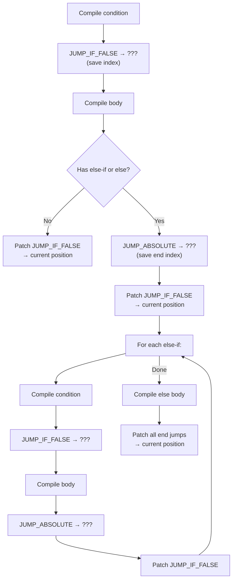

#### While Loop Compilation

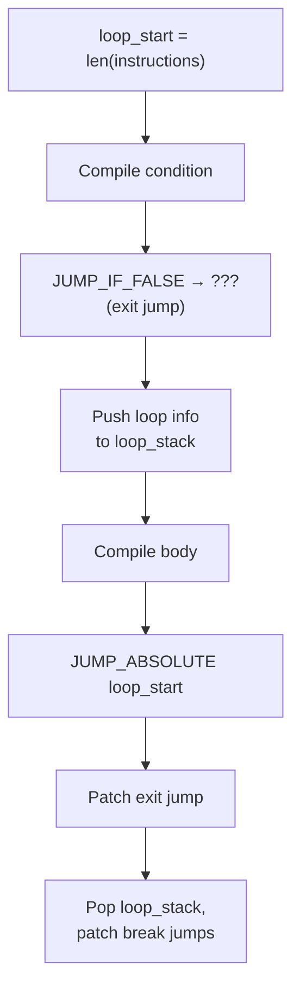

#### For Loop Compilation

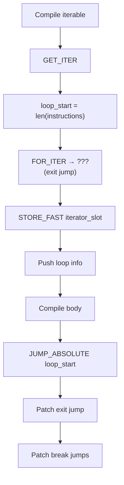

#### Break and Continue

- **`tor` (break)**: emits `JUMP_ABSOLUTE 0` (placeholder), appends index to `loop_stack[-1][2]` (break list). Later patched to the loop exit address.
- **`jari` (continue)**: emits `JUMP_ABSOLUTE loop_start` from `loop_stack[-1][0]`. Jumps directly to loop start.

#### Function Definition

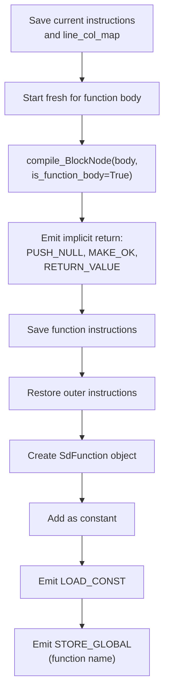

#### Block Compilation

```python
def compile_BlockNode(self, node, is_function_body=False):
    for i, stmt in enumerate(node.statements):
        is_last = i == len(node.statements) - 1
        if is_last and is_function_body and isinstance(stmt, EXPRESSION_NODES):
            # Implicit return: compile expression, wrap in Ok, return
            self.compile(stmt)
            self.emit(OpCode.MAKE_OK, node=stmt)
            self.emit(OpCode.RETURN_VALUE, node=stmt)
        else:
            self.compile(stmt)
            if isinstance(stmt, EXPRESSION_NODES):
                self.emit(OpCode.POP_TOP, node=stmt)  # Discard value
```

#### Return Statement

```python
def compile_ReturnNode(self, node):
    if node.value:
        self.compile(node.value)
    else:
        self.emit(OpCode.PUSH_NULL, node=node)
    self.emit(OpCode.MAKE_OK, node=node)  # Auto-wrap in Ok
    self.emit(OpCode.RETURN_VALUE, node=node)
```

#### Collections

| Node | Compilation |
|------|-------------|
| `ListNode([a, b, c])` | Compile a, b, c; `BUILD_LIST 3` |
| `DictNode({k1: v1, k2: v2})` | Compile k1, v1, k2, v2; `BUILD_DICT 2` |
| `SetNode({a, b})` | Compile a, b; `BUILD_SET 2` |
| `IndexNode(obj, idx)` | Compile obj, idx; `BINARY_SUBSCRIPT` |
| `IndexNode(obj, idx, val)` | Compile obj, idx, val; `STORE_SUBSCRIPT` |

#### Method Calls and Attribute Access

| Node | Compilation |
|------|-------------|
| `CallNode(name, args)` | Compile args; `CALL_FUNCTION (name_const, total_args)` |
| `MethodCallNode(obj, method, args)` | Compile obj, args; `CALL_METHOD (method_const, total_args)` |
| `GetAttrNode(obj, attr)` | Compile obj; `GET_ATTR (attr_const)` |
| `ResultConstructorNode("OK", val)` | Compile val; `MAKE_OK` |
| `ResultConstructorNode("GHALTI", val)` | Compile val; `MAKE_ERROR` |
| `ResultMethodCallNode(recv, "bachao", arg)` | Compile recv, arg; `CALL_BACHAO` |
| `ResultMethodCallNode(recv, "lazmi", arg)` | Compile recv, arg; `CALL_LAZMI` |
| `PostfixOpNode(expr, "?")` | Compile expr; `POSTFIX_QMARK` |
| `PostfixOpNode(expr, "!!")` | Compile expr; `POSTFIX_BANGBANG` |
| `KharabiNode(msg)` | Compile msg; `PANIC` |
| `TypeCastNode(type, expr)` | Compile expr; `TYPECAST (type_name_const)` |

---

## BytecodeFrame (`interpreter/backend/frame.py`)

A lightweight execution frame, one per function call (including main).

```python
class BytecodeFrame:
    __slots__ = (
        "name",  # str: function name or "main"
        "instructions",  # list[(opcode, arg)]: bytecode
        "constants",  # list: constant pool
        "line_col_map",  # dict[int, (line, col)]: source positions
        "slots",  # list[None] * slot_count: local variable storage
        "slot_metadata",  # dict[int, dict]: slot -> {is_const, type, ...}
        "ip",  # int: instruction pointer
        "call_metadata",  # dict: {return_type, function_name}
    )
```

### Slot Storage

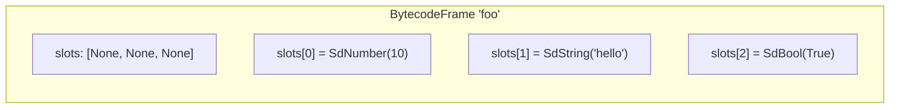

The `slots` list is pre-allocated to `slot_count` elements (all `None`). `LOAD_FAST i` reads `slots[i]`, `STORE_FAST i` writes to `slots[i]`.

---

## Virtual Machine (`interpreter/backend/vm.py`)

The VM (~671 lines) is a stack-based bytecode executor with a frame-based call stack.

### Architecture

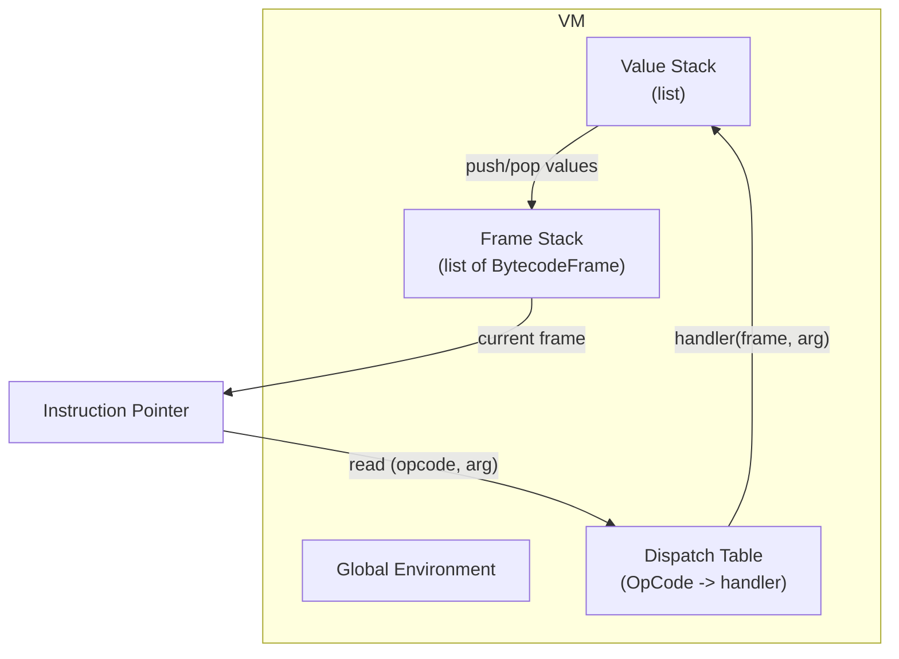

### Initialization

```python
class VM:
    def __init__(
        self,
        code_string,
        instructions,
        constants,
        globals_env,
        slot_count,
        slot_metadata,
        line_col_map,
    ):
        self.code_string = code_string
        self.globals = globals_env
        self.stack = []
        self.frames = [
            BytecodeFrame(
                "main", instructions, constants, line_col_map, slot_count, slot_metadata
            )
        ]
        self.simple_handler = SimpleBuiltins()
        self._setup_dispatch_table()
```

### Execution Loop

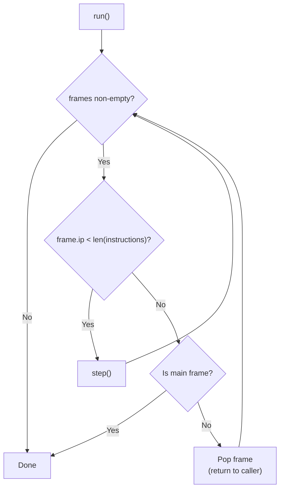

### Step Function

```python
def step(self):
    frame = self.frames[-1]
    line, column = frame.line_col_map.get(frame.ip, (0, 0))
    opcode, arg = frame.instructions[frame.ip]
    frame.ip += 1
    handler = self.dispatch_table[opcode]
    handler(frame, arg, line, column)
```

### Opcode Handlers

All handlers follow the signature: `_op_<name>(self, frame, arg, line, column)`.

#### Variable Access

```python
def _op_load_fast(self, frame, arg, line, column):
    self.push(frame.slots[arg])


def _op_store_fast(self, frame, arg, line, column):
    value = self.pop()
    # Check const enforcement
    if arg in frame.slot_metadata and frame.slot_metadata[arg].get("is_const"):
        if frame.slots[arg] is not None:
            raise HalndeVaktGhalti(...)
    # Check type enforcement
    if frame.slot_metadata[arg].get("has_explicit_type"):
        self._check_type(value, ...)
    frame.slots[arg] = value
```

#### Arithmetic Operations

All arithmetic handlers follow the same pattern:

```python
def _op_binary_add(self, frame, arg, line, column):
    right = self.pop()
    left = self.pop()
    left = self._unwrap_val(left, line, column)
    right = self._unwrap_val(right, line, column)
    loc = LocationProxy(line, column)
    result = left.call_method("__add__", [right], loc, self.code_string)
    self._handle_result(result)
    self.push(result)
```

The `_unwrap_val()` method auto-unwraps successful `SdResult` values and raises on error Results.

#### Function Calls

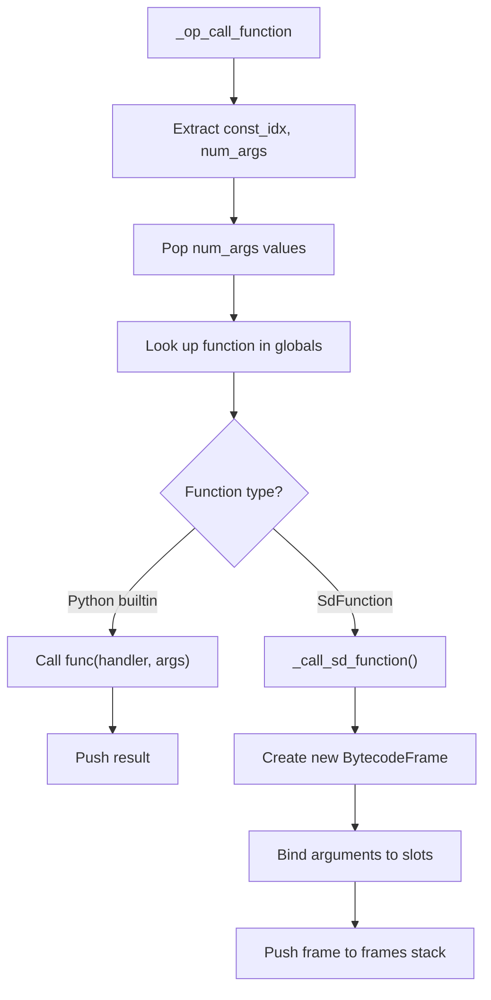

#### Argument Binding (`_call_sd_function`)

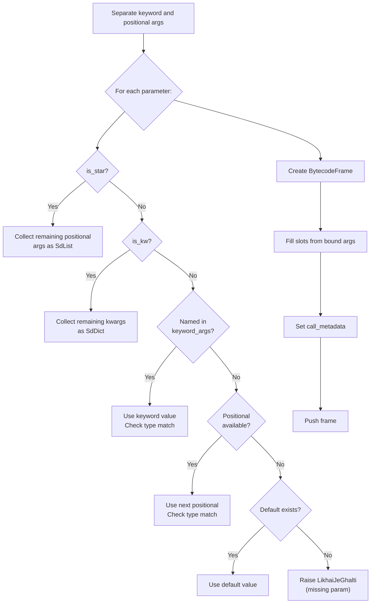

#### Method Dispatch

```python
def _op_call_method(self, frame, arg, line, column):
    args = [self.pop() for _ in range(arg)][::-1]
    obj = self.pop()
    obj = self._unwrap_val(obj, line, column)
    method_name = frame.constants[arg].value
    method = obj.type.lookup_method(method_name)
    if method is None:
        raise NaleJeGhalti(...)
    result = method(obj, *args)
    self.push(result)
```

#### Result System Operations

| Opcode | Behavior |
|--------|----------|
| `MAKE_OK` | Pop value; if already `SdResult`, push as-is; else wrap in `SdResult(OK, val)` |
| `MAKE_ERROR` | Pop value; if already `SdResult` error, push as-is; else wrap in `SdResult(GHALTI, val)` |
| `CALL_BACHAO` | Pop fallback, result; if OK push `.value`, else push fallback |
| `CALL_LAZMI` | Pop message, result; if OK push `.value`, else raise error with message |
| `POSTFIX_QMARK` | Pop result; if OK push `.value`, else push result as-is (keep error) |
| `POSTFIX_BANGBANG` | Pop result; if OK push `.value`, else raise error |

#### Return

```python
def _op_return_value(self, frame, arg, line, column):
    value = self.pop()
    self.frames.pop()  # Pop the function frame

    # Check return type annotation
    return_type = frame.call_metadata.get("return_type")
    if return_type and not isinstance(value, SdResult):
        # Type check the return value
        if not self._is_type_match(value, return_type):
            raise QisamJeGhalti(...)

    self.push(value)  # Push to caller's stack
```

#### Type Casting

```python
def _op_typecast(self, frame, arg, line, column):
    value = self.pop()
    value = self._unwrap_val(value, line, column)
    target_name = frame.constants[arg].value
    target_type = TYPE_MAP.get(target_name)

    if target_type == ADAD_TYPE:
        if isinstance(value, SdNumber):
            return self.push(SdNumber(int(value.value)))
        elif isinstance(value, SdString):
            return self.push(SdNumber(int(float(value.value))))
        elif isinstance(value, SdBool):
            return self.push(SdNumber(1 if value.value else 0))
    elif target_type == LAFZ_TYPE:
        return self.push(SdString(str(value)))
    # ... similar for DAHAI, FAISLO, FEHRIST, MAJMUO
    raise QisamJeGhalti(...)
```

### Error Handling in the VM

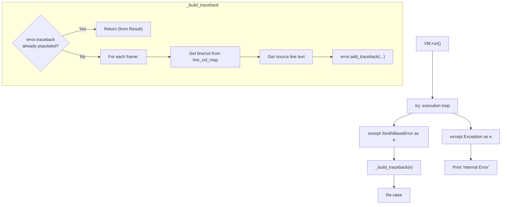

### Dispatch Table Setup

The `_setup_dispatch_table()` method maps each `OpCode` value to its handler method:

```python
def _setup_dispatch_table(self):
    self.dispatch_table = {
        OpCode.LOAD_CONST: self._op_load_const,
        OpCode.LOAD_FAST: self._op_load_fast,
        OpCode.STORE_FAST: self._op_store_fast,
        OpCode.LOAD_GLOBAL: self._op_load_global,
        OpCode.STORE_GLOBAL: self._op_store_global,
        OpCode.PUSH_NULL: self._op_push_null,
        OpCode.PUSH_TRUE: self._op_push_true,
        OpCode.PUSH_FALSE: self._op_push_false,
        # ... all 50 opcodes mapped
        OpCode.HALT: self._op_halt,
    }
```

The VM actually **generates** this table from handler names (`{op: getattr(self, f"_op_{op.name.lower()}") for op in OpCode}`), so a handler is never accidentally omitted — a missing `_op_*` method fails loudly at VM construction. `tests/test_dispatch_table.py` pins the handler↔opcode contract.

The VM uses a dictionary-based dispatch table (like CPython) rather than a large `match` statement or `if/elif` chain.
