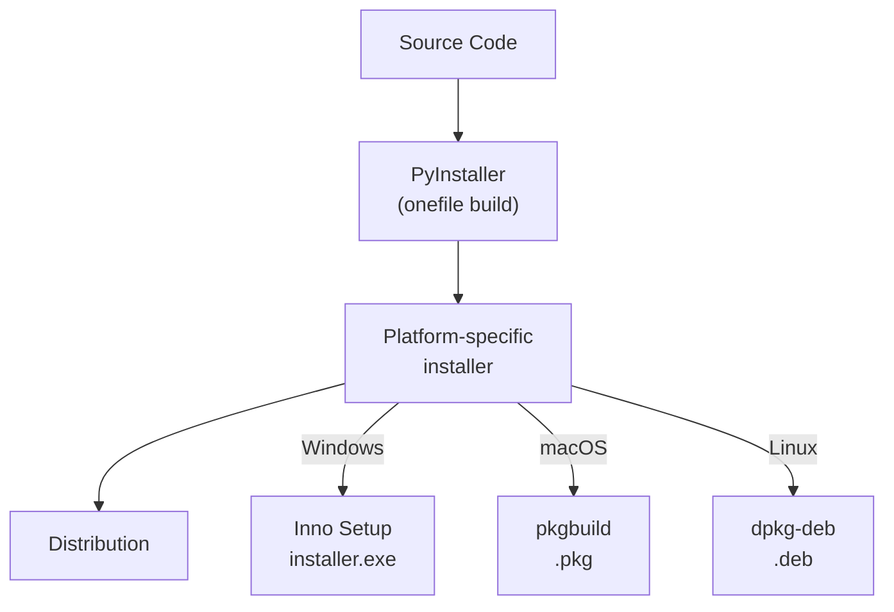
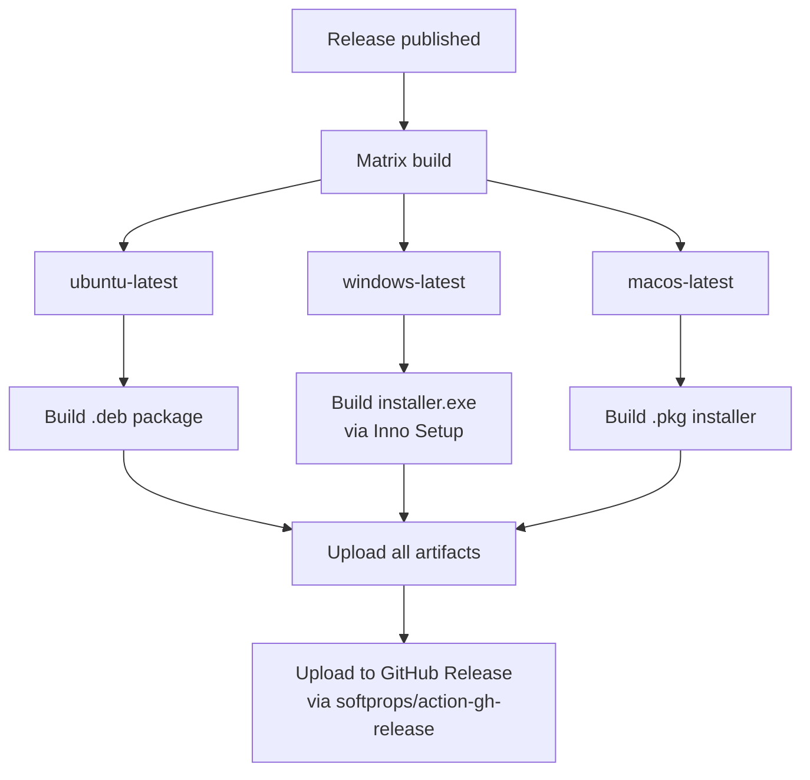

# Distribution and CI/CD

This document covers the build system, continuous integration, and platform-specific packaging for Sindlish.

## Build Pipeline



## Dependencies

### Runtime Dependencies (`pyproject.toml`)

| Package | Version | Purpose |
|---------|---------|---------|
| `prompt-toolkit` | `>=3.0.52` | REPL with syntax highlighting and autocompletion |
| `rich` | `>=15.0.0` | Terminal formatting, benchmark dashboard |

### Dev Dependencies

| Package | Version | Purpose |
|---------|---------|---------|
| `pytest` | `>=9.0.3` | Test framework |
| `pyinstaller` | latest | Binary bundling |

### Python Version

```
requires-python = ">=3.13"
```

## CI: GitHub Actions

### Continuous Integration (`.github/workflows/ci.yml`)

Triggers on every push and pull request to `main`:


Steps:
1. Checkout code
2. Install `uv` (Astral's Python package manager)
3. Set up Python
4. Install dependencies with `uv sync --all-groups`
5. Run tests with `uv run pytest`

### Build and Release (`.github/workflows/release.yml`)

Triggers on GitHub Release publish. Builds on 3 platforms in parallel:



Each platform build:
1. Checkout code
2. Setup uv + Python
3. Install dependencies + Pillow (for icon generation)
4. Generate platform icons (`tools/generate_icons.py`)
5. Build binary with PyInstaller (`--onefile`)
6. Create platform-specific installer

## Platform-Specific Packaging

### Windows: Inno Setup (`installer.iss`)

Creates a Windows installer with:
- Installs `dist/sindlish.exe` to `{autopf}\Sindlish` (Program Files)
- Creates a Start Menu shortcut
- Adds install directory to user's `PATH` (with smart deduplication)
- Custom icon and wizard images from `tools/`
- Output: `dist/sindlish-installer-win64.exe` with LZMA2 compression

### macOS: pkgbuild

Creates a `.pkg` installer using `pkgbuild`:
- Installs to `/usr/local/bin`
- Standard macOS package format

### Linux: dpkg-deb

Creates a `.deb` package:
- Installs to `/usr/local/bin`
- Standard Debian package format

## Running Benchmarks

```bash
python run_benchmarks.py
```

The benchmark suite compares Sindlish vs Python vs Rust on three algorithms:

| Benchmark | Description |
|-----------|-------------|
| Fibonacci | Naive recursive `fib(30)` and `fib(35)` |
| Loop | Sum of integers 0..100,000 |
| Primes | Count primes up to 5,000 |


The dashboard uses `rich.live` for real-time updates, showing source code panels and a results table.

## File Structure for Distribution

```
Sindlish/
├── dist/
│   ├── sindlish.exe                    # PyInstaller binary (Windows)
│   └── sindlish-installer-win64.exe    # Inno Setup installer
├── installer.iss                       # Inno Setup script
├── install.sh                          # macOS/Linux install script (placeholder)
├── tools/
│   ├── sindlish.ico                    # Windows icon
│   ├── sindlish.icns                   # macOS icon
│   ├── sindlish_icon.png               # Linux icon
│   └── wizard.bmp                      # Installer wizard images
└── .github/workflows/
    ├── ci.yml                          # Test on push/PR
    └── release.yml                     # Build + release
```
