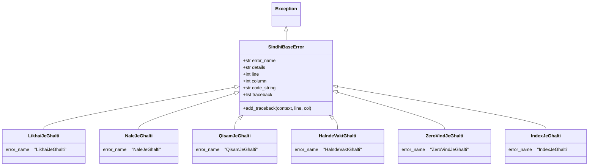
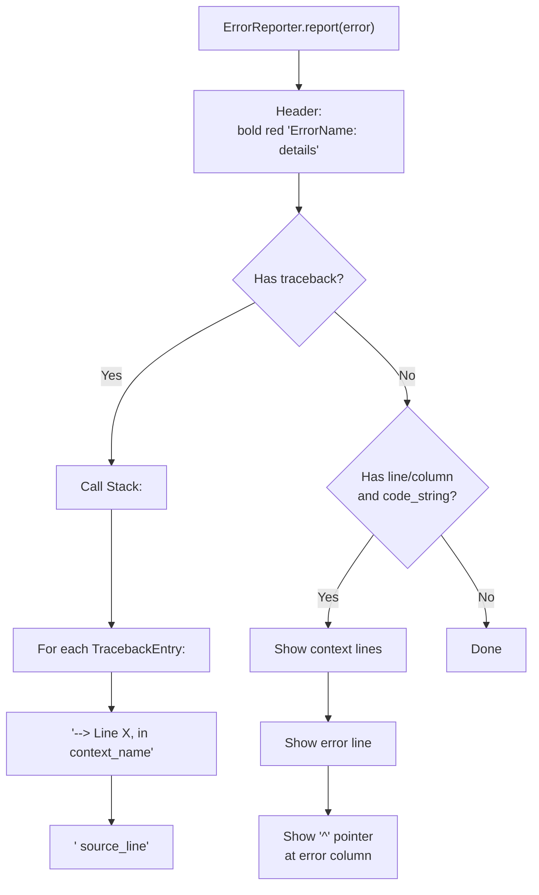
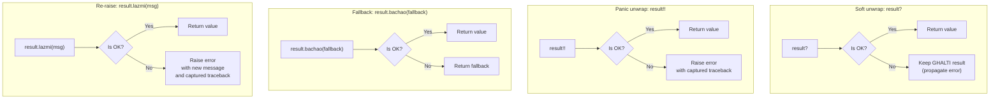
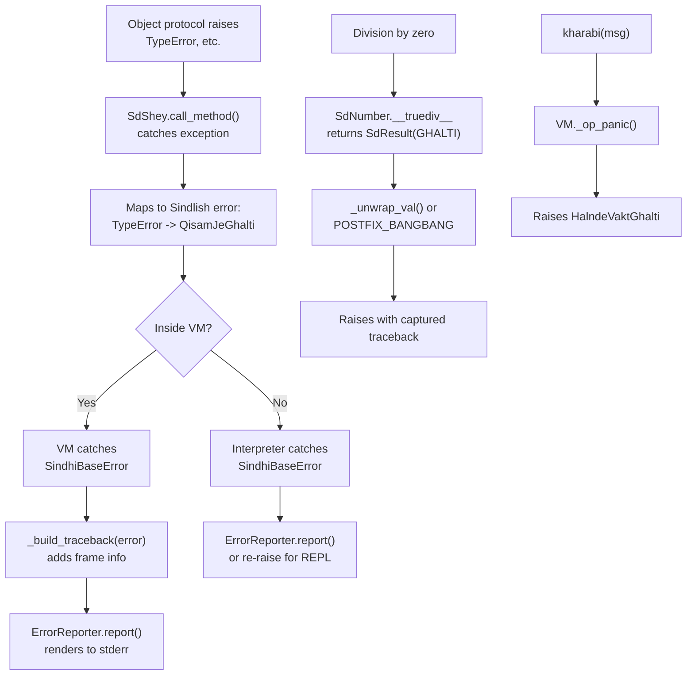

# Error System

Sindlish uses a two-tier error system: **exceptions** (`SindhiBaseError` subclasses) for unrecoverable errors, and **Results** (`SdResult`) for recoverable errors that can be propagated safely through the call stack.

## Error Hierarchy



## Error Types Reference

| Class | Sindhi Name | English | Raised When |
|-------|-------------|---------|-------------|
| `LikhaiJeGhalti` | "Writing error" | Syntax error | Lexer finds illegal character, parser finds unexpected token |
| `NaleJeGhalti` | "Name error" | Name error | Undefined variable or function lookup |
| `QisamJeGhalti` | "Type error" | Type error | Wrong type for operation, failed type cast, type annotation mismatch |
| `HalndeVaktGhalti` | "Runtime error" | Runtime error | Const reassignment, panic statement, unexpected runtime condition |
| `ZeroVindJeGhalti` | "Zero error" | Division by zero | Division or modulo by zero (also returned as Result) |
| `IndexJeGhalti` | "Index error" | Index out of bounds | Array/string index out of range |

## SindhiBaseError (`interpreter/errors.py`)

The base class for all Sindlish errors:

```python
class SindhiBaseError(Exception):
    def __init__(
        self,
        error_name,
        details,
        line=None,
        column=None,
        code_string=None,
        traceback=None,
    ):
        self.error_name = error_name
        self.details = details
        self.line = line
        self.column = column
        self.code_string = code_string
        self.traceback = traceback or []

    def add_traceback(self, context_name, line, column, source_line=None):
        self.traceback.append(TracebackEntry(context_name, line, column, source_line))
```

### TracebackEntry

```python
@dataclass
class TracebackEntry:
    context_name: str  # Function name or "main"
    line: int
    column: int
    source_line: str | None = None
```

## Error Rendering: `ErrorReporter`

The `ErrorReporter.report()` static method renders professional error messages to stderr:



### Example Output

```
QisamJeGhalti: LAFZ khe ADAD mein badal natho saghjay.

Call Stack (most recent call last):
  --> Line 3, in joda
      adad result = lafz(x) + y

  --> Line 7, in main
      joda("hello", 5)

Location:
  2 | adad x = 10
  3 | adad result = lafz(x) + y
                          ^
```

## Error-to-String Mapping: `ERROR_MAP`

```python
ERROR_MAP = {
    "LikhaiJeGhalti": LikhaiJeGhalti,
    "NaleJeGhalti": NaleJeGhalti,
    "QisamJeGhalti": QisamJeGhalti,
    "HalndeVaktGhalti": HalndeVaktGhalti,
    "ZeroVindJeGhalti": ZeroVindJeGhalti,
    "IndexJeGhalti": IndexJeGhalti,
}
```

This map is used by the Result system to reconstruct proper error classes when a GHALTI result is unwrapped with `!!` or `.lazmi()`.

---

## Result System

The Result system provides Rust-like error handling without exceptions. Results can be propagated, composed, and unwrapped safely.

### SdResult Object

```python
class SdResult(SdShey):
    OK = "OK"
    GHALTI = "GHALTI"

    def __init__(self, variant, value, error_cls=None):
        self.variant = variant
        self.value = value
        self.ok = SdBool(variant == self.OK)
        self.ghalti = SdBool(variant == self.GHALTI)
        self._captured_traceback = []
        self._error_cls = error_cls or "HalndeVaktGhalti"
```

### Creating Results

| Sindlish | AST Node | Bytecode | Result |
|----------|----------|----------|--------|
| `ok(value)` | `ResultConstructorNode("OK", value)` | `MAKE_OK` | `SdResult(OK, value)` |
| `ghalti(msg)` | `ResultConstructorNode("GHALTI", msg)` | `MAKE_ERROR` | `SdResult(GHALTI, msg)` |

### Unwrapping Results



### Bytecode Implementation

| Operation | Opcode | Behavior |
|-----------|--------|----------|
| `result?` | `POSTFIX_QMARK` | Pop result; if OK push `.value`, if GHALTI push result as-is |
| `result!!` | `POSTFIX_BANGBANG` | Pop result; if OK push `.value`, if GHALTI raise error |
| `result.bachao(fb)` | `CALL_BACHAO` | Pop fallback, result; return value or fallback |
| `result.lazmi(msg)` | `CALL_LAZMI` | Pop message, result; return value or raise with message |

### Traceback Capture

When a GHALTI result is created, it captures the current call stack:

```python
def capture_traceback(self, frames, code_string):
    if self.variant == self.GHALTI:
        for frame in frames:
            line, col = frame.line_col_map.get(frame.ip, (0, 0))
            source_line = self._get_source_line(code_string, line)
            self._captured_traceback.append(
                TracebackEntry(frame.name, line, col, source_line)
            )
```

This traceback is later used when the error is raised via `!!` or `.lazmi()`.

### Panic Statement

The `kharabi(msg)` statement raises an immediate runtime error:

| Sindlish | AST Node | Bytecode |
|----------|----------|----------|
| `kharabi("msg")` | `KharabiNode(msg)` | `PANIC` |

The VM handler:
```python
def _op_panic(self, frame, arg, line, column):
    message = self.pop()
    raise HalndeVaktGhalti(str(message.value), line, column, self.code_string)
```

---

## Error Propagation Flow



## Exception Mapping in `call_method()`

When a Python-level exception occurs during protocol dispatch, it is mapped to a Sindlish error:

| Python Exception | Sindlish Error |
|------------------|----------------|
| `TypeError` | `QisamJeGhalti` |
| `IndexError` | `IndexJeGhalti` |
| `ZeroDivisionError` | `ZeroVindJeGhalti` |
| `SindhiBaseError` | Re-raised as-is |
| Other `Exception` | `HalndeVaktGhalti` |
