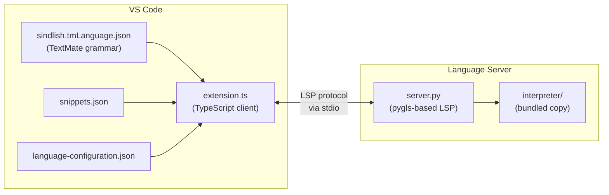
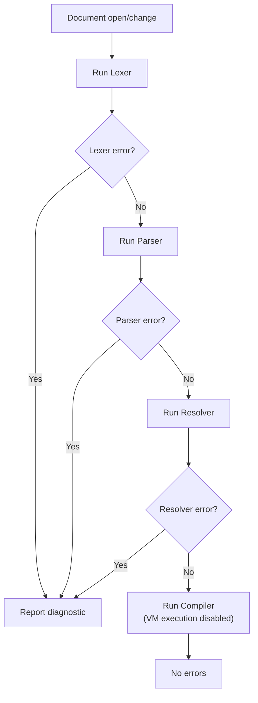
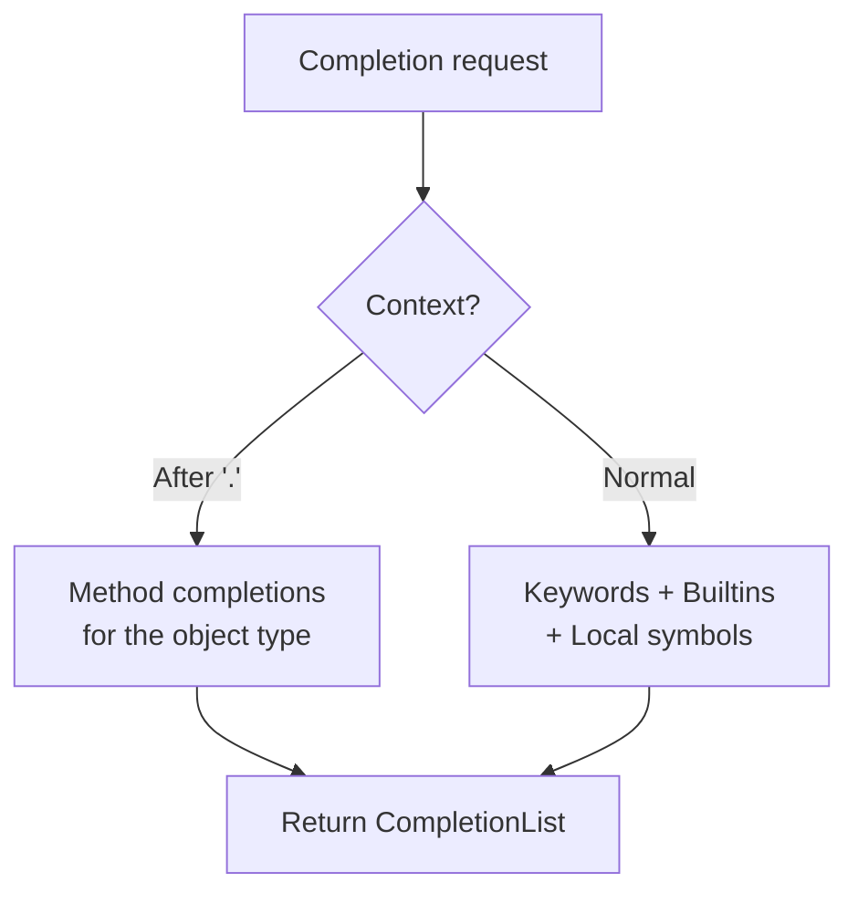

# VS Code Extension

The VS Code extension provides syntax highlighting, autocompletion, diagnostics, hover information, and go-to-definition for Sindlish files (`.sd`).

## Architecture



## Extension Manifest (`package.json`)

- **Publisher:** AmanatAliPanhwer
- **Version:** 0.1.1
- **File Association:** `.sd` files with language ID `sindlish`
- **Categories:** Programming Languages, Snippets, Linters
- **Dependencies:** `vscode-languageclient`

## Components

### 1. Extension Client (`src/extension.ts`)

The TypeScript client that:
- Starts the Python Language Server as a child process
- Sets up `DiagnosticCollection` for error reporting
- Shows a status bar indicator (spinning while starting, checkmark when running, error on failure)
- Wires up `publishDiagnostics` notifications from the server

### 2. Language Server (`server/server.py`)

A full Language Server Protocol implementation using `pygls` (Python Language Server Protocol):

#### Capabilities

| Feature | Description |
|---------|-------------|
| **Diagnostics** | Runs the full Sindlish pipeline (Lexer -> Parser -> Resolver -> Compiler) on every document open/change, reports errors as VS Code diagnostics |
| **Completions** | Provides keyword, builtin, local symbol, and method completions |
| **Hover** | Shows symbol info (name, kind, type) when hovering over identifiers |
| **Go-to-Definition** | Navigates to where a symbol is defined |

#### Validation Flow



#### Completions



The server provides completions from:
1. **Keywords** (28 entries from `KEYWORDS` dict)
2. **Built-in functions** (5 from `SimpleBuiltins`)
3. **Local symbols** from the Resolver's symbol table
4. **Method completions** triggered by `.` (dot), specific to the object type:
   - Lists: 11 methods
   - Dicts: 10 methods
   - Sets: 14 methods
   - Strings: basic methods
   - Results: `bachao`, `lazmi`

### 3. TextMate Grammar (`syntaxes/sindlish.tmLanguage.json`)

Auto-generated by `tools/generate_grammar.py`. Provides syntax highlighting for:

| Element | Scope |
|---------|-------|
| Keywords | `keyword.control.sindlish` |
| Data types | `storage.type.sindlish` |
| Builtins | `support.function.sindlish` |
| Strings | `string.quoted.sindlish` |
| Numbers | `constant.numeric.sindlish` |
| Comments | `comment.line.sindlish` / `comment.block.sindlish` |
| Operators | `keyword.operator.sindlish` |
| Identifiers | `variable.other.sindlish` |

### 4. Language Configuration (`language-configuration.json`)

Defines editor behavior:
- **Comment tokens:** `#` (line) and `/* */` (block)
- **Bracket pairs:** `()`, `{}`, `[]`
- **Auto-closing pairs:** `"`, `'`, `(`, `{`, `[`

### 5. Snippets (`snippets/snippets.json`)

8 built-in code snippets:

| Prefix | Description | Body |
|--------|-------------|------|
| `kaam` | Function definition | `kaam name() { ... }` |
| `agar` | If statement | `agar condition { ... }` |
| `jistain` | While loop | `jistain condition { ... }` |
| `pakko` | Constant declaration | `pakko name = value` |
| `adad` | Typed integer | `adad name = 0` |
| `fehrist` | Typed list | `fehrist[type] name = []` |
| `ok` | Result OK return | `wapas ok(value)` |
| `ghalti` | Result error return | `wapas ghalti(message)` |

## Bundled Interpreter

The extension bundles a complete copy of the Sindlish interpreter under `server/interpreter/`. This ensures the Language Server can analyze code without depending on an external Sindlish installation. The bundled copy includes all components: lexer, parser, resolver, compiler, VM, objects, and builtins.

## Building the Extension

```bash
# Install dependencies
cd vscode-extension
npm install

# Package as .vsix
vsce package

# Install locally
code --install-extension sindlish-0.1.1.vsix
```

## Developer Tools (`tools/`)

### `generate_grammar.py`

Auto-generates three files by introspecting the interpreter:

1. `sindlish.tmLanguage.json` — TextMate grammar for syntax highlighting
2. `sindlish-definitions.json` — Completion definitions
3. `language-configuration.json` — Editor behavior

```bash
python tools/generate_grammar.py
```

This ensures the VS Code extension stays in sync with the language definition. When you add a new keyword or builtin to the interpreter, running this script automatically updates the extension.

### `lint.py`

A simple static-analysis linter that runs the Lexer and Parser on a `.sd` file:

```bash
python tools/lint.py file.sd
# Output: OK or "Error at line X: ..."
```

### `generate_icons.py`

Uses Pillow to generate platform-specific icons from the VS Code logo PNG:
- Windows `.ico` (multi-size)
- macOS `.icns`
- Inno Setup `.bmp` wizard images
- Linux `.png` (512x512)
