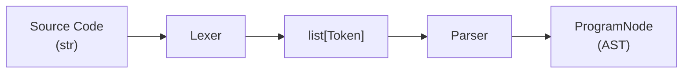
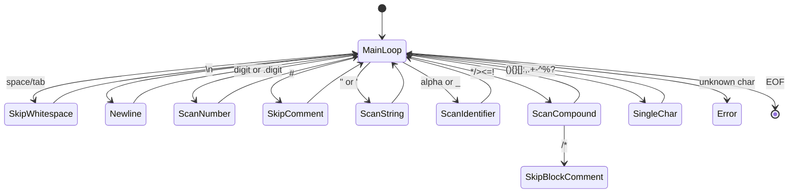
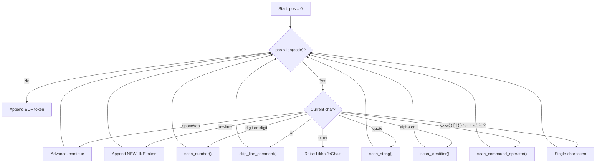
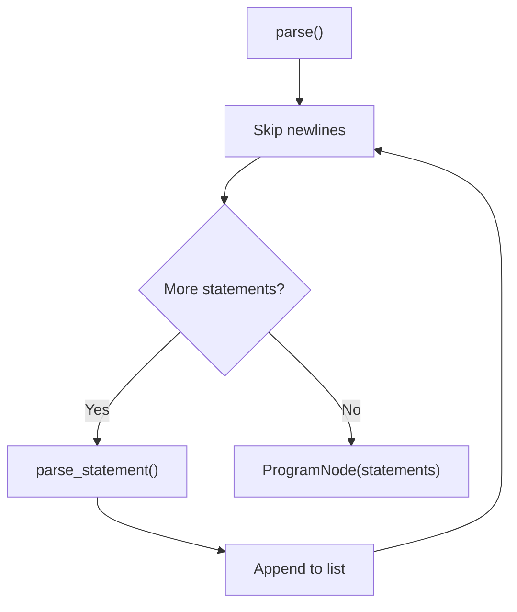
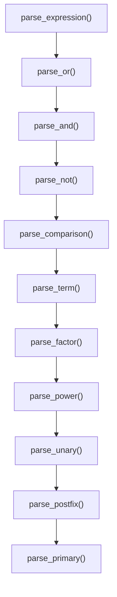

# Frontend: Lexer, Parser, and AST

The frontend converts raw Sindlish source code text into an Abstract Syntax Tree (AST). It consists of three components: the **Lexer** (tokenization), the **Parser** (recursive descent), and the **AST node definitions**.

## Pipeline



---

## Lexer (`interpreter/frontend/lexer.py`)

The Lexer converts source code into a flat list of `Token` objects using a character-by-character scanner. It is approximately 300 lines.

### Architecture



### Character Access

The lexer uses three methods for character-level lookahead:

| Method | Description | Advances? |
|--------|-------------|-----------|
| `_peek()` | Returns current character | No |
| `_peek_ahead()` | Returns next character (pos + 1) | No |
| `_advance()` | Returns current character, moves forward | Yes |

On `_advance()`, if the character is `\n`, `self.line` increments and `self.column` resets to 1. Otherwise `self.column` increments.

### Scanning Methods

#### `_scan_number()`

Reads digits and at most one decimal point. Returns:
- `Token(ADAD, int_value)` if no decimal point (e.g. `42`)
- `Token(DAHAI, float_value)` if one decimal point (e.g. `3.14`)
- Breaks if a second dot is encountered (e.g. `1.2.3` stops at `1.2`)

#### `_scan_string()`

Supports single quotes (`'`), double quotes (`"`), and triple-quoted strings (`"""` / `'''`).

Handles escape sequences via `codecs.decode(string_content, "unicode_escape")`. Falls back to raw string on `UnicodeDecodeError`.

Returns `Token(LAFZ, decoded_string)`.

#### `_scan_identifier()`

Reads alphanumeric characters and underscores. Looks up the result in the `KEYWORDS` dict:
- If found: returns the keyword's `TokenType` (e.g. `agar` -> `Token(AGAR, 'agar')`)
- If not found: returns `Token(IDENTIFIER, name)`

#### `_skip_line_comment()`

Advances until `\n` or end of input. Skips everything after `#`.

#### `_skip_block_comment()`

Advances until `*/` is found. Checks for the closing sequence using `_peek() == '*'` and `_peek_ahead() == '/'`.

#### `_scan_compound_operator(char)`

Handles all multi-character operators:

| Char | Next Char | Result |
|------|-----------|--------|
| `*` | `*` | `DBLSTAR` (`**`) |
| `*` | `*` (after `/`) | Block comment (skip) |
| `/` | `*` | Block comment (skip) |
| `/` | other | `DIV` |
| `>` | `=` | `GTEQ` |
| `<` | `=` | `LTEQ` |
| `=` | `=` | `EQEQ` |
| `!` | `=` | `NOTEQ` |
| `!` | `!` | `BANGBANG` |

### Main Loop: `generate_tokens()`



### Key Constants

**`_SINGLE_CHAR_TOKENS`** (14 entries):

```
+ -> PLUS, - -> MINUS, % -> MOD, ^ -> POW, ? -> QMARK
( -> LPAREN, ) -> RPAREN, { -> LBRACE, } -> RBRACE
[ -> LBRACKET, ] -> RBRACKET, : -> COLON, , -> COMMA, . -> DOT
```

**`_COMPOUND_STARTERS`**: `frozenset("*/><=!")`

---

## Token Types (`interpreter/frontend/tokens.py`)

The `TokenType` enum defines 60 token types organized into categories.

### Data Types (12 + 1)

| TokenType | Sindlish | Meaning |
|-----------|----------|---------|
| `ADAD` | adad | Integer |
| `LAFZ` | lafz | String |
| `DAHAI` | dahai | Float |
| `FAISLO` | faislo | Boolean |
| `SACH` | sach | True literal |
| `KOORE` | koorh | False literal |
| `KHALI` | khali | Null literal |
| `PAKKO` | pakko | Const modifier |
| `FEHRIST` | fehrist | List type |
| `LUGHAT` | lughat | Dict type |
| `MAJMUO` | majmuo | Set type |
| `KAAM` | kaam | Function type |
| `IDENTIFIER` | -- | Variable/function names |

### Keywords (16)

| TokenType | Sindlish | English |
|-----------|----------|---------|
| `AGAR` | agar | if |
| `YAWARI` | yawari | else if |
| `WARNA` | warna | else |
| `JISTAIN` | jistain | while |
| `HAR` | har | for |
| `MEIN` | mein | in |
| `TOR` | tor | break |
| `JARI` | jari | continue |
| `WAPAS` | wapas | return |
| `LIKH` | likh | print |
| `BAHARI` | bahari | nonlocal |
| `AALMI` | aalmi | global |
| `MATCH` | match | match |
| `OK` | ok | Result OK |
| `GHALTI` | ghalti | Result Error |
| `KHARABI` | kharabi | Panic (deprecated) |

### Operators (19)

| TokenType | Symbol | Description |
|-----------|--------|-------------|
| `PLUS` | `+` | Addition / concatenation |
| `MINUS` | `-` | Subtraction / negation |
| `MUL` | `*` | Multiplication / repetition |
| `DIV` | `/` | Division |
| `MOD` | `%` | Modulo |
| `POW` | `^` | Exponentiation |
| `GT` | `>` | Greater than |
| `LT` | `<` | Less than |
| `EQ` | `=` | Assignment |
| `EQEQ` | `==` | Equality |
| `NOTEQ` | `!=` | Inequality |
| `GTEQ` | `>=` | Greater or equal |
| `LTEQ` | `<=` | Less or equal |
| `AND` | `aen` | Logical AND |
| `OR` | `ya` | Logical OR |
| `NOT` | `nah` / `!` | Logical NOT |
| `QMARK` | `?` | Soft unwrap |
| `BANGBANG` | `!!` | Panic unwrap |
| `DBLSTAR` | `**` | Keyword args |

### Symbols (12)

| TokenType | Symbol |
|-----------|--------|
| `LPAREN` | `(` |
| `RPAREN` | `)` |
| `LBRACE` | `{` |
| `RBRACE` | `}` |
| `LBRACKET` | `[` |
| `RBRACKET` | `]` |
| `COLON` | `:` |
| `COMMA` | `,` |
| `DOT` | `.` |
| `NEWLINE` | `\n` |
| `EOF` | end of file |

### Token Dataclass

```python
@dataclass(frozen=True, slots=True)
class Token:
    type: TokenType
    value: Any
    line: int
    column: int
```

---

## Keyword Mappings (`interpreter/frontend/keywords.py`)

### `KEYWORDS` dict (28 entries)

Maps Sindhi keyword strings to their `TokenType`:

```
agar    -> AGAR       yawari  -> YAWARI     warna   -> WARNA
jistain -> JISTAIN    aen     -> AND        ya      -> OR
nah     -> NOT        adad    -> ADAD       lafz    -> LAFZ
dahai   -> DAHAI      faislo  -> FAISLO     sach    -> SACH
koorh   -> KOORE      khali   -> KHALI      pakko   -> PAKKO
fehrist -> FEHRIST    lughat  -> LUGHAT     majmuo  -> MAJMUO
bahari  -> BAHARI     aalmi   -> AALMI      kaam    -> KAAM
wapas   -> WAPAS      match   -> MATCH      ok      -> OK
ghalti  -> GHALTI     kharabi -> KHARABI    har     -> HAR
tor     -> TOR        jari    -> JARI       mein    -> MEIN
```

### `DATATYPES` tuple (8 entries)

```python
DATATYPES = (ADAD, LAFZ, DAHAI, FAISLO, KHALI, FEHRIST, LUGHAT, MAJMUO)
```

These are the types that can be used in type annotations (e.g. `adad x = 5`).

---

## Parser (`interpreter/frontend/parser.py`)

The Parser is a recursive descent parser that converts a token stream into an AST. It is approximately 826 lines.

### Architecture

The parser uses a `pos` index to traverse the token list and dispatches based on the current token type. It follows the standard recursive descent pattern with operator precedence encoded in the call chain.

### Navigation Methods

| Method | Description |
|--------|-------------|
| `peek()` | Returns current token (or None at end) |
| `advance()` | Returns current token, increments pos |
| `previous()` | Returns token at pos - 1 |
| `peek_ahead()` | Returns token at pos + 1 |
| `skip_newlines()` | Advances past all NEWLINE tokens |
| `_at_pos(node, token)` | Stamps node with position from token |

### Top-Level Parsing



### Statement Dispatch

`parse_statement()` dispatches based on the current token:

| Token | Method | Produces |
|-------|--------|----------|
| `LIKH` | `parse_print()` | `PrintNode` |
| `AGAR` | `parse_if()` | `IfNode` |
| `JISTAIN` | `parse_while()` | `WhileNode` |
| `KAAM` | `parse_function_def()` | `FunctionNode` |
| `WAPAS` | `parse_return()` | `ReturnNode` |
| `HAR` | `parse_for()` | `ForNode` |
| `TOR` | (direct) | `BreakNode` |
| `JARI` | (direct) | `ContinueNode` |
| `PAKKO` | `parse_assignment()` | `AssignNode` |
| DATATYPE + IDENTIFIER | `parse_assignment()` | `AssignNode` |
| IDENTIFIER + `=` or `:` | `parse_assignment()` | `AssignNode` |
| IDENTIFIER + other | `parse_expression()` | expression node |
| `LBRACE` | `parse_block()` | `BlockNode` |
| `AALMI` | (direct) | `GlobalNode` |
| `BAHARI` | (direct) | `NonLocalNode` |
| other | `parse_expression()` | expression node |

### Expression Precedence

The parser encodes precedence through the call chain. Each level calls the next higher-precedence level:



| Level | Method | Operators | Associativity |
|-------|--------|-----------|---------------|
| 1 (lowest) | `parse_or` | `ya` (OR) | Left |
| 2 | `parse_and` | `aen` (AND) | Left |
| 3 | `parse_not` | `nah` (NOT) | Right (unary) |
| 4 | `parse_comparison` | `==`, `!=`, `>`, `<`, `>=`, `<=` | Left |
| 5 | `parse_term` | `+`, `-` | Left |
| 6 | `parse_factor` | `*`, `/`, `%` | Left |
| 7 | `parse_power` | `^` | Right |
| 8 | `parse_unary` | `-`, `nah` | Right |
| 9 | `parse_postfix` | `?`, `!!`, `.`, `[]`, `()` | Left |
| 10 (highest) | `parse_primary` | literals, identifiers, `()` | -- |

### Statement Parsers

#### `parse_if()`

Parses `agar condition { body } [yawari cond2 { body2 }]... [warna { else_body }]`.

Returns `IfNode(condition, body, else_body, else_if_bodies)` where `else_if_bodies` is a list of `(condition, body)` tuples.

#### `parse_while()`

Parses `jistain condition { body }`. Returns `WhileNode(condition, body)`.

#### `parse_for()`

Parses `har iterator_name mein iterable { body }`. Returns `ForNode(iterator_name, iterable, body)`.

#### `parse_function_def()`

Parses `kaam name(params) -> ReturnType { body }`.

Returns `FunctionNode(name, params, body, return_type)`.

#### `parse_assignment()`

Handles all declaration forms:
1. `pakko` (const) prefix
2. Type annotation: `adad x = 5` or `fehrist[adad] x = []` or `x: adad = 5`
3. Default values for typed uninitialized variables

Returns `AssignNode(name, value, type, is_const, element_type, has_explicit_type)`.

#### `parse_print()`

Handles `likh`, `likh(expr)`, `likh()`. Returns `PrintNode(value)`.

### Function Parameters

`_parse_function_params()` parses between `(` and `)`:
- `*args` (star parameter)
- `**kwargs` (keyword parameter)
- Type annotations: `adad x` or `x: adad`
- Default values: `x = 5`
- Trailing commas allowed

Returns a list of `ParamNode(name, type, default, is_star, is_kw)`.

### Postfix Parsing

`parse_postfix()` handles after `parse_primary()`:
- `?` -> `PostfixOpNode(expr, '?')`
- `!!` -> `PostfixOpNode(expr, '!!')`
- `.method(args)` -> `MethodCallNode` or `ResultMethodCallNode`
- `.attr` -> `GetAttrNode`
- `[index]` -> `IndexNode`
- `(args)` -> `CallNode`

### Dict/Set Disambiguation

`parse_dict_set()` determines whether `{a, b}` is a set or `{a: 1, b: 2}` is a dict by checking if `:` follows the first expression.

---

## AST Nodes (`interpreter/frontend/ast_nodes.py`)

All 36 AST node classes inherit from `Node`, which provides `line` and `column` fields and a `set_pos()` method for chaining.

### Base Class

```python
class Node:
    __slots__ = ('line', 'column')
    def __init__(self, line=0, column=0): ...
    def set_pos(self, line, column) -> 'Node': ...
```

### Complete Node Reference

#### Literal Nodes

| Node | Fields | Description |
|------|--------|-------------|
| `NumberNode` | `value: int\|float` | Integer or float literal. `get_type()` returns ADAD or DAHAI. |
| `StringNode` | `value: str` | String literal. `get_type()` returns LAFZ. |
| `BoolNode` | `value: bool` | Boolean literal (sach/koorh). `get_type()` returns FAISLO. |
| `NullNode` | `value: None` | Null literal (khali). |

#### Variable Nodes

| Node | Fields | Description |
|------|--------|-------------|
| `VariableNode` | `name, slot_index, scope_level` | Variable reference. `slot_index` and `scope_level` set by Resolver. |
| `AssignNode` | `name, value, type, is_const, element_type, has_explicit_type, slot_index, scope_level` | Variable declaration/assignment. |

#### Operator Nodes

| Node | Fields | Description |
|------|--------|-------------|
| `BinaryOpNode` | `left, op, right` | Binary operation (e.g. `x + y`). |
| `UnaryOpNode` | `op, right` | Unary operation (e.g. `-x`, `nah x`). |
| `PostfixOpNode` | `expr, op` | Postfix operation (`?`, `!!`). |

#### Statement Nodes

| Node | Fields | Description |
|------|--------|-------------|
| `PrintNode` | `value` | Print statement (`likh`). |
| `IfNode` | `condition, body, else_body, else_if_bodies` | If/elif/else chain. |
| `WhileNode` | `condition, body` | While loop (`jistain`). |
| `ForNode` | `iterator, iterable, body, iterator_slot` | For-in loop (`har...mein`). |
| `BreakNode` | -- | Break statement (`tor`). |
| `ContinueNode` | -- | Continue statement (`jari`). |
| `BlockNode` | `statements` | Block of statements `{ ... }`. |
| `ProgramNode` | `statements, slot_count` | Top-level program. `slot_count` set by Resolver. |

#### Collection Nodes

| Node | Fields | Description |
|------|--------|-------------|
| `ListNode` | `elements` | List literal `[a, b]`. `get_type()` returns FEHRIST. |
| `DictNode` | `pairs` | Dict literal `{k: v}`. |
| `SetNode` | `elements` | Set literal `{a, b}`. |
| `IndexNode` | `left, index, value` | Index access `obj[i]` or assignment `obj[i] = v` (when `value` is set). |

#### Function Nodes

| Node | Fields | Description |
|------|--------|-------------|
| `ParamNode` | `name, type, default, is_star, is_kw, slot_index` | Function parameter. |
| `FunctionNode` | `name, params, body, return_type, slot_count` | Function definition (`kaam`). |
| `CallNode` | `name, args, keywords, star_args, kw_args` | Function call. |
| `ReturnNode` | `value` | Return statement (`wapas`). |
| `MethodCallNode` | `instance, method_name, args, keywords, star_args, kw_args` | Method call `obj.method()`. |
| `GetAttrNode` | `instance, attr_name` | Attribute access `obj.attr`. |

#### Scoping Nodes

| Node | Fields | Description |
|------|--------|-------------|
| `GlobalNode` | `name` | Global declaration (`aalmi`). |
| `NonLocalNode` | `name` | Nonlocal declaration (`bahari`). |

#### Pattern Matching Nodes

| Node | Fields | Description |
|------|--------|-------------|
| `MatchNode` | `expr, cases` | Match expression. |
| `MatchCaseNode` | `pattern, body` | Match case. |

#### Result System Nodes

| Node | Fields | Description |
|------|--------|-------------|
| `ResultConstructorNode` | `variant, value` | `ok(value)` or `ghalti(value)`. |
| `ResultMethodCallNode` | `receiver, method_name, arg` | `.bachao(fallback)` or `.lazmi(msg)`. |
| `KharabiNode` | `message` | Panic statement (`kharabi(msg)`). |

#### Type System Nodes

| Node | Fields | Description |
|------|--------|-------------|
| `TypeCastNode` | `target_type, expr` | Type cast `adad(x)`, `lafz(y)`. |

### Grammar Summary

```ebnf
program     = statement* EOF

statement   = print_stmt
            | if_stmt
            | while_stmt
            | for_stmt
            | func_def
            | return_stmt
            | break_stmt
            | continue_stmt
            | assignment
            | block
            | global_decl
            | nonlocal_decl
            | expression

expression  = or
or          = and ("ya" and)*
and         = not ("aen" not)*
not         = "nah" not | comparison
comparison  = term (("==" | "!=" | ">" | "<" | ">=" | "<=") term)*
term        = factor (("+" | "-") factor)*
factor      = power (("*" | "/" | "%") power)*
power       = unary ("^" power)?           (* right-associative *)
unary       = ("-" | "nah") unary | postfix
postfix     = primary ("?" | "!!" | "." ident | "[" expr "]" | "(" args ")")*

primary     = NUMBER | STRING | BOOL | NULL
            | IDENT
            | "(" expression ")"
            | list | dict | set
            | type_cast | result_ctor | kharabi

list        = "[" (expression ("," expression)*)? "]"
dict        = "{" (expr ":" expr ("," expr ":" expr)*)? "}"
set         = "{" (expression ("," expression)*)? "}"

func_def    = "kaam" IDENT "(" params ")" ("->" type)? block
params      = (param ("," param)*)?
param       = ("*" | "**")? type? IDENT (":" type)? ("=" expression)?

if_stmt     = "agar" expression block ("yawari" expression block)* ("warna" block)?
while_stmt  = "jistain" expression block
for_stmt    = "har" IDENT "mein" expression block
block       = "{" statement* "}"

assignment  = "pakko"? type? IDENT (":" type)? "=" expression
```
