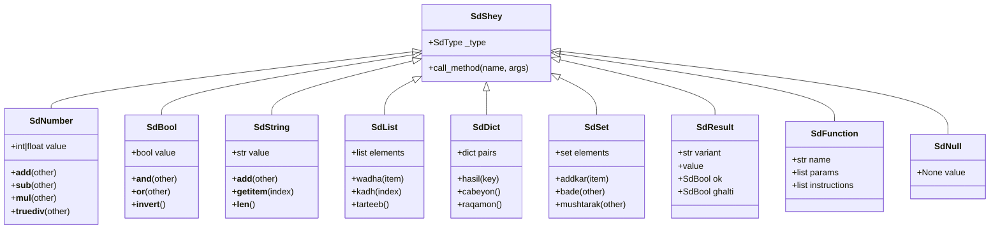
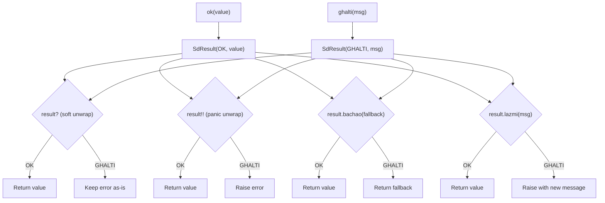

# Concrete Object Types

This document describes all concrete Sindlish object types — the runtime values that exist during execution. Every Sindlish value is an instance of `SdShey` (the base class) or one of its subclasses.

## Overview



---

## SdNumber (`interpreter/objects/numbers.py`)

Wraps Python `int` or `float` values. Uses `ADAD_TYPE` for integers and `DAHAI_TYPE` for floats.

### Fields

| Field | Type | Description |
|-------|------|-------------|
| `value` | `int` or `float` | The numeric value |

### Type Detection

```python
def __init__(self, value):
    self.value = value
    if isinstance(value, float):
        self._type = DAHAI_TYPE
    else:
        self._type = ADAD_TYPE
```

### Arithmetic Operations

All arithmetic checks that `other` is an `SdNumber`. Raises `QisamJeGhalti` on type mismatch.

| Method | Operation | Returns | Special |
|--------|-----------|---------|---------|
| `__add__(other)` | `self + other` | `SdNumber` | -- |
| `__sub__(other)` | `self - other` | `SdNumber` | -- |
| `__mul__(other)` | `self * other` | `SdNumber` | -- |
| `__truediv__(other)` | `self / other` | `SdResult` | Returns GHALTI on division by zero |
| `__mod__(other)` | `self % other` | `SdResult` | Returns GHALTI on division by zero |
| `__pow__(other)` | `self ^ other` | `SdNumber` | -- |

**Division by zero** returns a Result instead of raising:
```python
def __truediv__(self, other):
    if not isinstance(other, SdNumber):
        raise QisamJeGhalti(...)
    if other.value == 0:
        return SdResult(SdResult.GHALTI, "ZeroVindJeGhalti")
    return SdResult(SdResult.OK, SdNumber(self.value / other.value))
```

### Comparison Operations

All return `SdBool`:

| Method | Operation |
|--------|-----------|
| `__eq__(other)` | `self == other` |
| `__ne__(other)` | `self != other` |
| `__gt__(other)` | `self > other` |
| `__lt__(other)` | `self < other` |
| `__ge__(other)` | `self >= other` |
| `__le__(other)` | `self <= other` |

### Unary Operations

| Method | Operation | Returns |
|--------|-----------|---------|
| `__neg__()` | `-self` | `SdNumber` |
| `__pos__()` | `+self` | `SdNumber` |
| `__abs__()` | `abs(self)` | `SdNumber` |
| `__invert__()` | `~int(self)` | `SdNumber` |

### Bitwise Operations

| Method | Operation | Returns |
|--------|-----------|---------|
| `__and__(other)` | `int(self) & int(other)` | `SdNumber` |
| `__or__(other)` | `int(self) \| int(other)` | `SdNumber` |

### Conversions

| Method | Returns |
|--------|---------|
| `__str__()` | `str(self.value)` |
| `__int__()` | `int(self.value)` |
| `__float__()` | `float(self.value)` |
| `__hash__()` | `hash(self.value)` |
| `__bool__()` | `True` (non-zero) |

---

## SdBool (`interpreter/objects/numbers.py`)

Wraps Python `bool`. Uses `FAISLO_TYPE`.

### Fields

| Field | Type | Description |
|-------|------|-------------|
| `value` | `bool` | The boolean value |

### Logical Operations

| Method | Operation | Returns |
|--------|-----------|---------|
| `__and__(other)` | `self aen other` | `SdBool` |
| `__or__(other)` | `self ya other` | `SdBool` |
| `__invert__()` | `nah self` | `SdBool` |

### String Representation

| Value | `__str__()` |
|-------|-------------|
| `True` | `"such"` |
| `False` | `"koorh"` |

### Other

| Method | Returns |
|--------|---------|
| `__eq__(other)` | `SdBool` |
| `__ne__(other)` | `SdBool` |
| `__hash__()` | `hash(self.value)` |
| `__bool__()` | `bool(self.value)` |

---

## SdString (`interpreter/objects/strings.py`)

Wraps Python `str`. Uses `LAFZ_TYPE`. Supports concatenation, repetition, indexing, and iteration.

### Fields

| Field | Type | Description |
|-------|------|-------------|
| `value` | `str` | The string value |

### Operations

| Method | Operation | Returns |
|--------|-----------|---------|
| `__add__(other)` | `"hello" + "world"` | `SdString` (concatenation) |
| `__mul__(other)` | `"ha" * 3` | `SdString` ("hahaha") |
| `__rmul__(other)` | `3 * "ha"` | `SdString` |
| `__len__()` | `lambi("hello")` | `SdNumber(5)` |
| `__getitem__(idx)` | `"hello"[0]` | `SdString("h")` |
| `__contains__(item)` | `"h" in "hello"` | `SdBool(True)` |
| `__iter__()` | `for c in "hello"` | iterates characters |
| `__eq__(other)` | `str1 == str2` | `SdBool` |
| `__lt__(other)` | `str1 < str2` | `SdBool` |

### Iteration

Strings are iterable — iterating yields individual characters as `SdString` objects.

---

## SdList (`interpreter/objects/collections.py`)

Wraps a Python `list`. Uses `FEHRIST_TYPE`. Mutable sequence type.

### Fields

| Field | Type | Description |
|-------|------|-------------|
| `elements` | `list` | The list elements |

### Protocol Methods

| Method | Operation | Returns |
|--------|-----------|---------|
| `__add__(other)` | list concatenation | `SdList` |
| `__mul__(other)` | list repetition | `SdList` |
| `__len__()` | length | `SdNumber` |
| `__getitem__(idx)` | element access | element |
| `__setitem__(idx, val)` | element assignment | `SdNull` |
| `__contains__(item)` | membership test | `SdBool` |
| `__iter__()` | iteration | iterator |
| `__str__()` | string representation | `SdString` |

### Registered Sindlish Methods (11)

| Method | Sindlish | Signature | Description |
|--------|----------|-----------|-------------|
| `wadha` | append | `list.wadha(item)` | Appends item to end. Returns the list. |
| `wadhayo` | extend | `list.wadhayo(other_list)` | Extends with another list's elements. |
| `wajh` | insert | `list.wajh(index, item)` | Inserts at given position. |
| `hata` | remove | `list.hata(item)` | Removes first occurrence by equality. Raises if not found. |
| `kadh` | pop | `list.kadh()` or `list.kadh(index)` | Removes and returns element at index (or end). |
| `saf` | clear | `list.saf()` | Removes all elements. |
| `index` | index | `list.index(item)` | Returns index of first occurrence. Raises if not found. |
| `garn` | count | `list.garn(item)` | Returns count of occurrences. |
| `tarteeb` | sort | `list.tarteeb()` | Sorts in place by `.value` attribute. |
| `ulto` | reverse | `list.ulto()` | Reverses in place. |
| `nakal` | copy | `list.nakal()` | Returns a shallow copy. |

### Example Usage

```
fehrist adad nums = [3, 1, 2]
nums.wadha(4)          # [3, 1, 2, 4]
nums.tarteeb()         # [1, 2, 3, 4]
nums.ulto()            # [4, 3, 2, 1]
adad idx = nums.index(3)  # idx = 1
```

---

## SdDict (`interpreter/objects/collections.py`)

Wraps a Python `dict`. Uses `LUGHAT_TYPE`. Mutable mapping type.

### Fields

| Field | Type | Description |
|-------|------|-------------|
| `pairs` | `dict` | The key-value pairs |

### Protocol Methods

| Method | Operation | Returns |
|--------|-----------|---------|
| `__len__()` | length | `SdNumber` |
| `__getitem__(key)` | key access | value (raises if key not found) |
| `__setitem__(key, val)` | key assignment | `SdNull` |
| `__contains__(key)` | key membership | `SdBool` |
| `__iter__()` | iteration | iterates keys |
| `__str__()` | string representation | `SdString` |

### Registered Sindlish Methods (10)

| Method | Sindlish | Signature | Description |
|--------|----------|-----------|-------------|
| `hasil` | get | `dict.hasil(key, default)` | Returns value for key, or default if not found. |
| `syon` | items | `dict.syon()` | Returns list of `[key, value]` pairs. |
| `cabeyon` | keys | `dict.cabeyon()` | Returns list of keys. |
| `raqamon` | values | `dict.raqamon()` | Returns list of values. |
| `syonkadh` | popitem | `dict.syonkadh()` | Removes and returns last `[key, value]` pair. |
| `defaultrakh` | setdefault | `dict.defaultrakh(key, default)` | Sets default if key missing, returns value. |
| `update` | update | `dict.update(other_dict)` | Updates with another dict's pairs. |
| `kadh` | pop | `dict.kadh(key)` or `dict.kadh(key, default)` | Removes and returns value for key. |
| `saf` | clear | `dict.saf()` | Removes all pairs. |
| `nakal` | copy | `dict.nakal()` | Returns a shallow copy. |

### Example Usage

```
lughat lafz adad ages = {"alice": 25, "bob": 30}
ages.hasil("alice")        # 25
ages.cabeyon()              # ["alice", "bob"]
ages.kadh("bob")           # 30
ages.defaultrakh("charlie", 35)  # 35
```

---

## SdSet (`interpreter/objects/collections.py`)

Wraps a Python `set`. Uses `MAJMUO_TYPE`. Mutable set type. Elements must be hashable.

### Fields

| Field | Type | Description |
|-------|------|-------------|
| `elements` | `set` | The set elements |

### Protocol Methods

| Method | Operation | Returns |
|--------|-----------|---------|
| `__add__(other)` | union | `SdSet` |
| `__sub__(other)` | difference | `SdSet` |
| `__mul__(other)` | intersection | `SdSet` |
| `__le__(other)` | subset check | `SdBool` |
| `__lt__(other)` | proper subset | `SdBool` |
| `__ge__(other)` | superset check | `SdBool` |
| `__gt__(other)` | proper superset | `SdBool` |
| `__len__()` | length | `SdNumber` |
| `__contains__(item)` | membership | `SdBool` |
| `__iter__()` | iteration | iterator |
| `__str__()` | string representation | `SdString` |

### Registered Sindlish Methods (14)

| Method | Sindlish | Signature | Description |
|--------|----------|-----------|-------------|
| `addkar` | add | `set.addkar(item)` | Adds item. Rejects mutable types (list, dict, set). |
| `chad` | discard | `set.chad(item)` | Removes item if present (no error if missing). |
| `hata` | remove | `set.hata(item)` | Removes item. Raises if not found. |
| `kadh` | pop | `set.kadh()` | Removes and returns arbitrary element. |
| `saf` | clear | `set.saf()` | Removes all elements. |
| `nakal` | copy | `set.nakal()` | Returns a shallow copy. |
| `update` | update | `set.update(other)` | Adds elements from another set. Rejects mutable elements. |
| `bade` | union | `set.bade(other)` | Returns new set (union). |
| `mushtarak` | intersection | `set.mushtarak(other)` | Returns new set (intersection). |
| `farq` | difference | `set.farq(other)` | Returns new set (difference). |
| `symmetric_farq` | sym. difference | `set.symmetric_farq(other)` | Returns new set (symmetric difference). |
| `nandohisoahe` | issubset | `set.nandohisoahe(other)` | Returns `SdBool`. |
| `wadohisoahe` | issuperset | `set.wadohisoahe(other)` | Returns `SdBool`. |
| `alaghahe` | isdisjoint | `set.alaghahe(other)` | Returns `SdBool`. |

### Mutable Type Rejection

The `addkar` and `update` methods check that elements are not mutable (lists, dicts, or sets):

```python
def addkar(self, item):
    if isinstance(item, (SdList, SdDict, SdSet)):
        raise QisamJeGhalti("Mutable type cannot be added to set")
    self.elements.add(item)
```

---

## SdResult (`interpreter/objects/core.py`)

Implements the Result type system for safe error handling. Two variants: `OK` (success) and `GHALTI` (error).

### Fields

| Field | Type | Description |
|-------|------|-------------|
| `variant` | `str` | `"OK"` or `"GHALTI"` |
| `value` | any | The wrapped value |
| `ok` | `SdBool` | `True` if variant is OK |
| `ghalti` | `SdBool` | `True` if variant is GHALTI |
| `_captured_traceback` | `list` | Captured call stack for error reporting |
| `_error_cls` | `str` | Error class name (default: `"HalndeVaktGhalti"`) |

### Methods

| Method | Description |
|--------|-------------|
| `is_ok()` | Returns `True` if variant is OK |
| `is_error()` | Returns `True` if variant is GHALTI |
| `capture_traceback(frames, code)` | Captures the call stack for later error reporting |

### Usage Patterns



---

## SdFunction (`interpreter/objects/core.py`)

A closure-like object that bundles a function's compiled bytecode with its metadata.

### Fields

| Field | Type | Description |
|-------|------|-------------|
| `name` | `str` | Function name |
| `params` | `list[ParamNode]` | Parameter definitions |
| `instructions` | `list` | Compiled bytecode instructions |
| `constants` | `list` | Constant pool |
| `line_col_map` | `dict` | Source position mapping |
| `slot_count` | `int` | Number of local variable slots |
| `slot_metadata` | `dict` | Slot metadata (types, const flags) |
| `return_type` | `str\|None` | Return type annotation (e.g. `"ADAD"`) |

### String Representation

```python
def __str__(self):
    return f"<kaam {self.name}>"
```

---

## SdNull (`interpreter/objects/core.py`)

Singleton-like null value. Represents the absence of a value.

### Fields

| Field | Type | Description |
|-------|------|-------------|
| `value` | `None` | Always `None` |

### Behavior

| Method | Returns |
|--------|---------|
| `__eq__(other)` | `SdBool(isinstance(other, SdNull))` |
| `__ne__(other)` | `SdBool(not isinstance(other, SdNull))` |
| `__str__()` | `"khali"` |
| `__bool__()` | `False` |
| `__hash__()` | `hash(None)` |

Any two `SdNull` instances are equal to each other.
