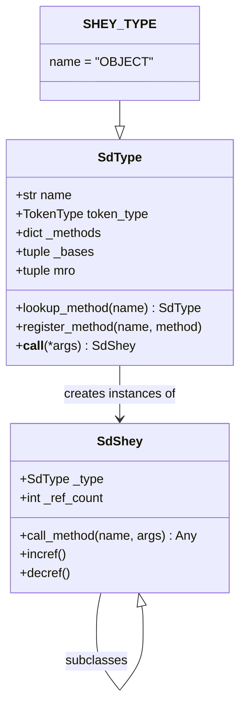
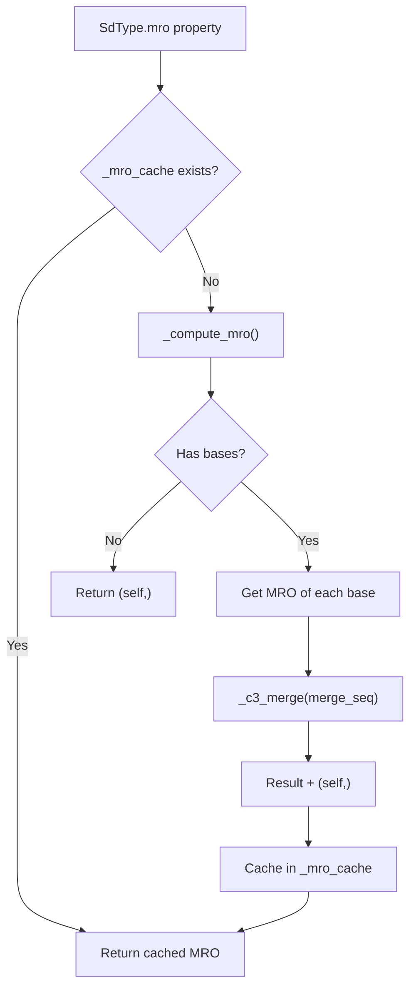
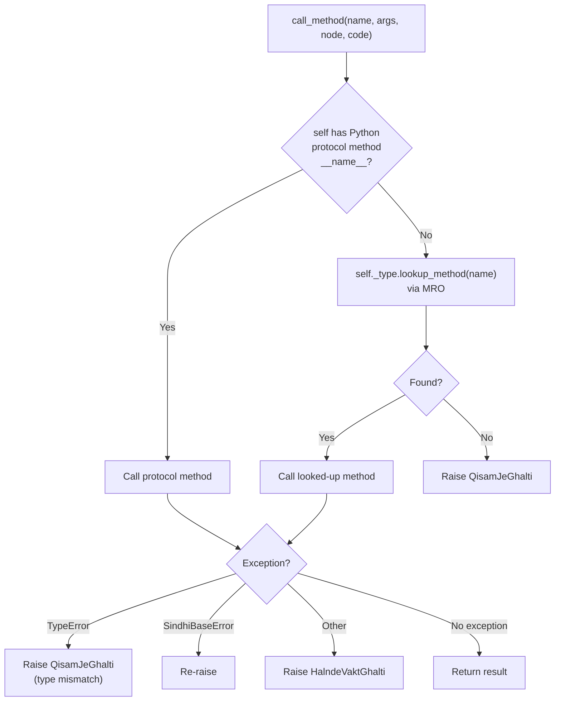
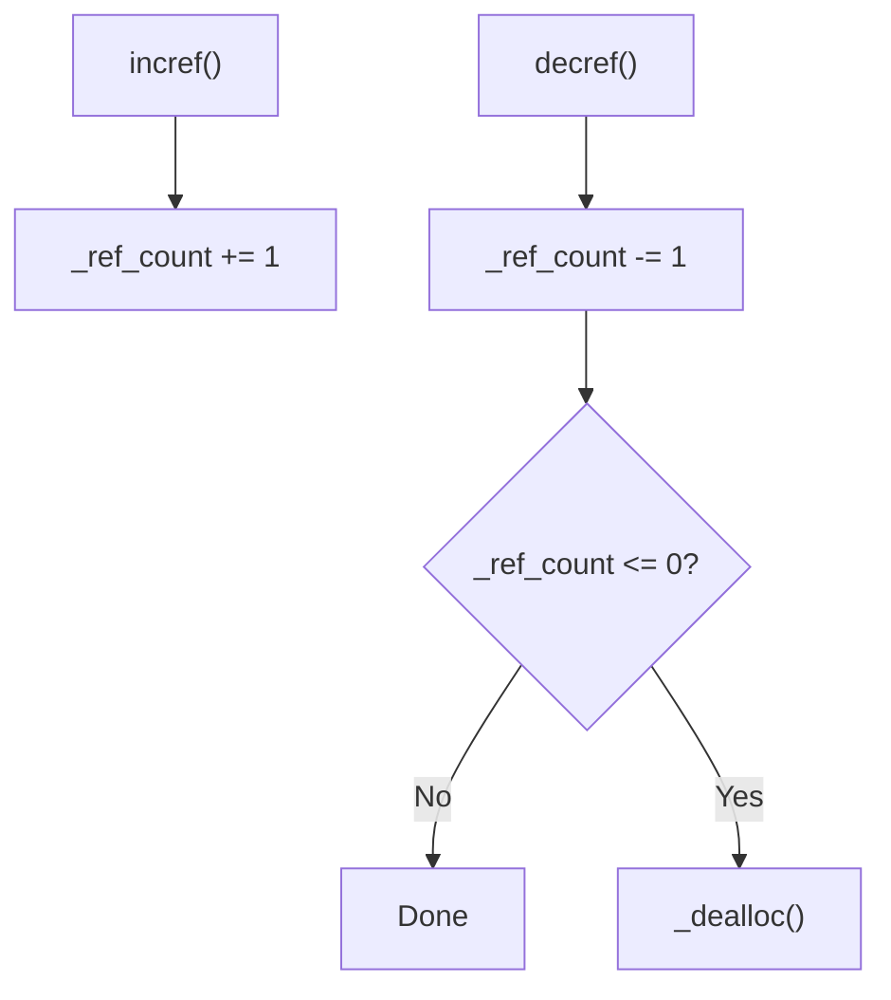
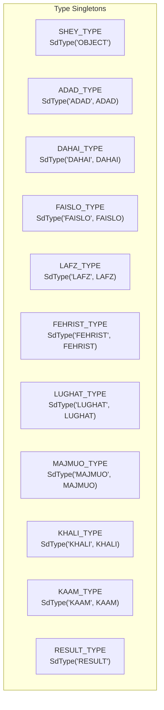
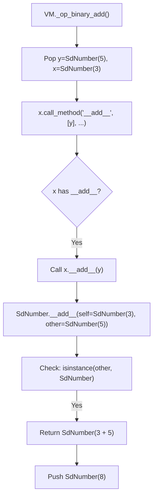
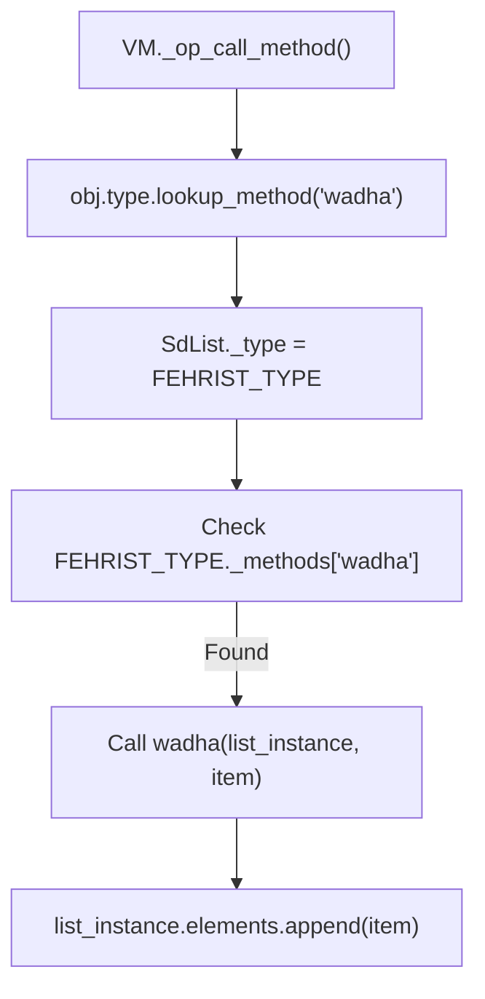

# Object Model: SdType and SdShey

The Sindlish object model is built on two base classes: `SdType` (the metaclass, responsible for type identity and method resolution) and `SdShey` (the base object, responsible for protocol dispatch and reference counting). All Sindlish runtime values are instances of `SdShey` subclasses.

## Class Hierarchy



---

## SdType (`interpreter/objects/base.py`)

`SdType` is the metaclass for all Sindlish types. It is responsible for:
- Type identity (name + token_type)
- Method registry (built-in methods)
- Method resolution order (MRO) via C3 linearization
- Instance creation

### Fields

```python
class SdType:
    __slots__ = (
        "name",
        "token_type",
        "_methods",
        "_bases",
        "_mro_cache",
        "_instance_class",
    )
```

| Field | Type | Description |
|-------|------|-------------|
| `name` | `str` | Type name (e.g. `"ADAD"`, `"LAFZ"`) |
| `token_type` | `TokenType` | Corresponding token type (or `None` for RESULT) |
| `_methods` | `dict` | Method name -> callable mapping |
| `_bases` | `tuple` | Parent types for inheritance |
| `_mro_cache` | `tuple\|None` | Cached MRO (invalidated when bases change) |
| `_instance_class` | `type\|None` | Python class for `__new__` |

### Instance Creation

```python
def __call__(self, *args, **kwargs):
    return self._new(*args, **kwargs)


def _new(self, *args, **kwargs):
    if self._instance_class:
        instance = object.__new__(self._instance_class)
    else:
        instance = object.__new__(type(self))
    instance._type = self
    instance._ref_count = 1
    if hasattr(instance, "__init__"):
        instance.__init__(*args, **kwargs)
    return instance
```

### Method Registry

```python
def register_method(self, name, method):
    self._methods[name] = method


def get_method(self, name):
    return self._methods.get(name)
```

Methods are registered on the type singleton, not on individual instances. For example, `FEHRIST_TYPE.register_method("wadha", list_append)` registers the `wadha` (append) method for all list instances.

### MRO: Method Resolution Order



#### C3 Linearization

The `_c3_merge()` method implements the standard C3 linearization algorithm (same as Python):

```python
def _c3_merge(self, sequences):
    result = []
    while sequences:
        # Find head of first sequence not in any tail
        for seq in sequences:
            head = seq[0]
            if not any(head in s[1:] for s in sequences):
                break
        else:
            raise RuntimeError("Inconsistent MRO")

        result.append(head)
        # Remove head from all sequences
        sequences = [s[1:] for s in sequences if s[0] == head]
    return result
```

#### MRO Lookup

```python
def lookup_method(self, name):
    for cls in self.mro:  # Walk MRO chain
        method = cls.get_method(name)
        if method is not None:
            return method
    return None
```

### Equality and Hashing

```python
def __eq__(self, other):
    return (
        isinstance(other, SdType)
        and self.name == other.name
        and self.token_type == other.token_type
    )


def __hash__(self):
    return hash((self.name, self.token_type))
```

---

## SdShey (`interpreter/objects/base.py`)

`SdShey` is the base class for all Sindlish runtime objects. It provides:
- Type association (each instance has a `_type` pointing to its `SdType`)
- Protocol dispatch (`call_method()`)
- Default protocol methods (dunder methods)
- Reference counting

### Fields

```python
class SdShey:
    __slots__ = ("_type", "_ref_count")
```

### Protocol Methods

Every `SdShey` instance has default implementations of Python's dunder/protocol methods. Subclasses override these to define behavior:

| Method | Default Behavior | Overridden By |
|--------|------------------|---------------|
| `__eq__(other)` | Identity: `id(self) == id(other)` | SdNumber, SdBool, SdString, SdNull, SdResult |
| `__ne__(other)` | `not self.__eq__(other)` | Same |
| `__hash__()` | `id(self)` | SdNumber, SdBool, SdString, SdNull, SdResult |
| `__repr__()` | `"<TYPE object at 0x...>"` | All subclasses |
| `__str__()` | `"<TYPE object>"` | All subclasses |
| `__bool__()` | `True` | SdBool, SdNull, SdNumber, SdString |
| `__len__()` | Raises `TypeError` | SdList, SdDict, SdSet, SdString |
| `__iter__()` | Raises `TypeError` | SdList, SdDict, SdSet, SdString |
| `__getitem__(idx)` | Raises `TypeError` | SdList, SdDict, SdString |
| `__setitem__(idx, val)` | Raises `TypeError` | SdList, SdDict |
| `__contains__(item)` | Raises `TypeError` | SdList, SdDict, SdSet, SdString |

### Protocol Dispatch: `call_method()`

This is the core dispatch mechanism used by the VM for all operations:



The dispatch has two levels:

1. **Python protocol methods**: Check if the object has a Python dunder method (e.g. `__add__`). If so, call it directly. This is how `SdNumber.__add__`, `SdList.__getitem__`, etc. work.

2. **MRO-based method lookup**: If no Python protocol method exists, look up the method in the type's MRO chain. This is how registered methods like `wadha` (list append) work.

### Reference Counting



- `incref()`: Increments the reference count
- `decref()`: Decrements; if count reaches 0, calls `_dealloc()`
- `_dealloc()`: No-op by default (can be overridden for cleanup)

---

## Type Singletons

Each Sindlish type has a singleton `SdType` instance:



| Singleton | Name | TokenType | Instance Class |
|-----------|------|-----------|----------------|
| `SHEY_TYPE` | `"OBJECT"` | `None` | `SdShey` |
| `ADAD_TYPE` | `"ADAD"` | `ADAD` | `SdNumber` |
| `DAHAI_TYPE` | `"DAHAI"` | `DAHAI` | `SdNumber` |
| `FAISLO_TYPE` | `"FAISLO"` | `FAISLO` | `SdBool` |
| `LAFZ_TYPE` | `"LAFZ"` | `LAFZ` | `SdString` |
| `FEHRIST_TYPE` | `"FEHRIST"` | `FEHRIST` | `SdList` |
| `LUGHAT_TYPE` | `"LUGHAT"` | `LUGHAT` | `SdDict` |
| `MAJMUO_TYPE` | `"MAJMUO"` | `MAJMUO` | `SdSet` |
| `KHALI_TYPE` | `"KHALI"` | `KHALI` | `SdNull` |
| `KAAM_TYPE` | `"KAAM"` | `KAAM` | `SdFunction` |
| `RESULT_TYPE` | `"RESULT"` | `None` | `SdResult` |

---

## Example: How `x + y` is Dispatched

When the VM encounters `BINARY_ADD` with `x = SdNumber(3)` and `y = SdNumber(5)`:



When `x` is a `SdList` and we call `.wadha(item)`:


