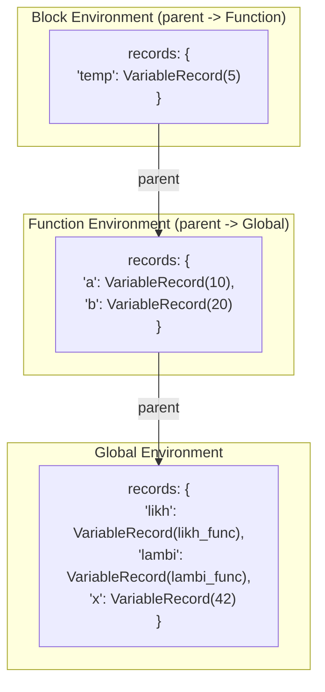
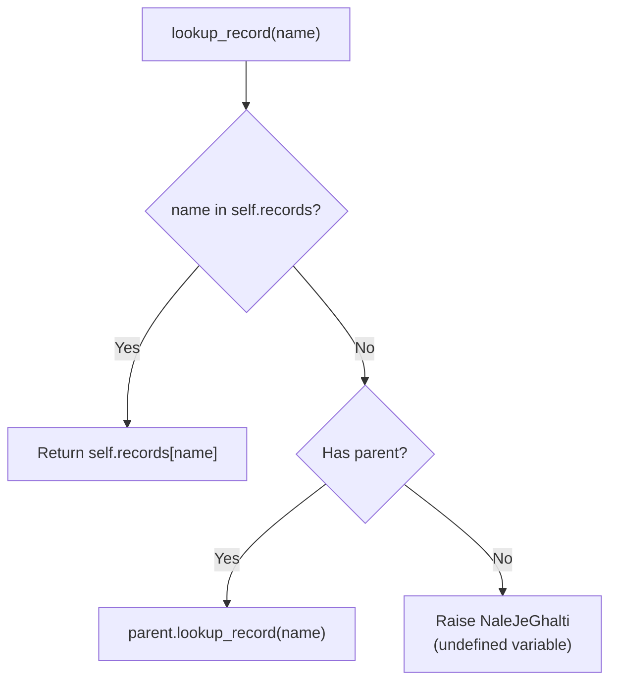
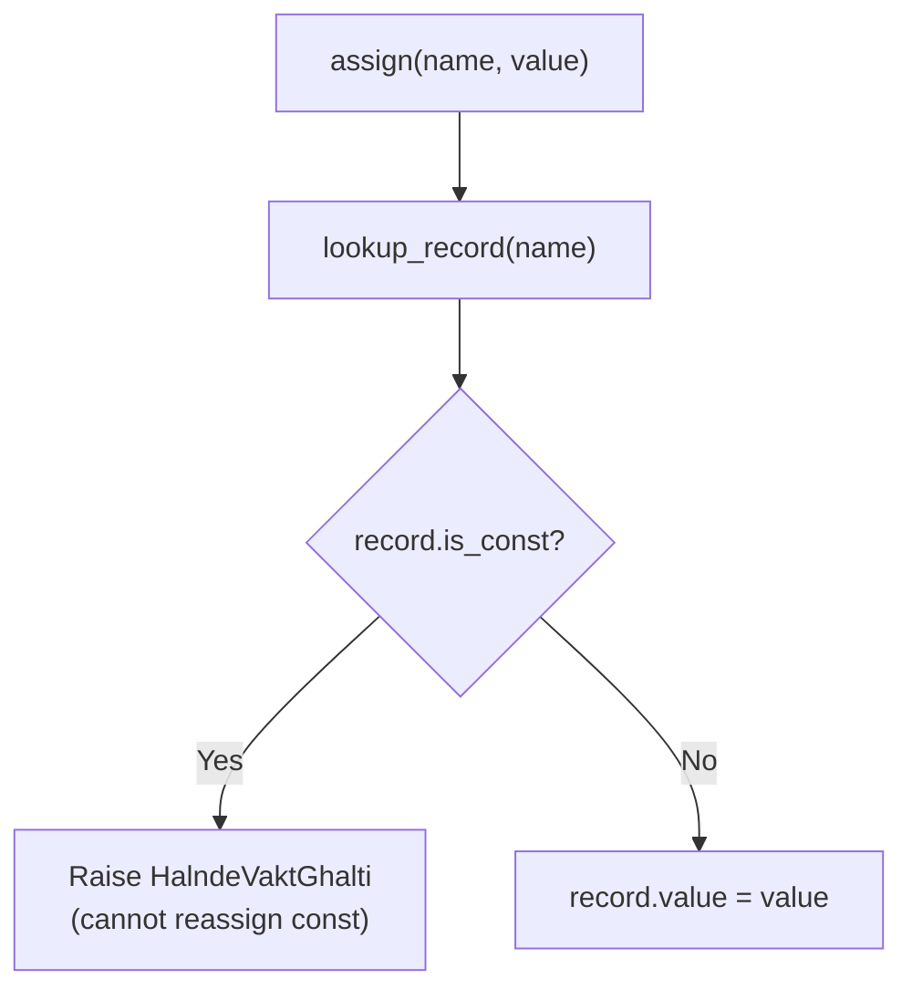
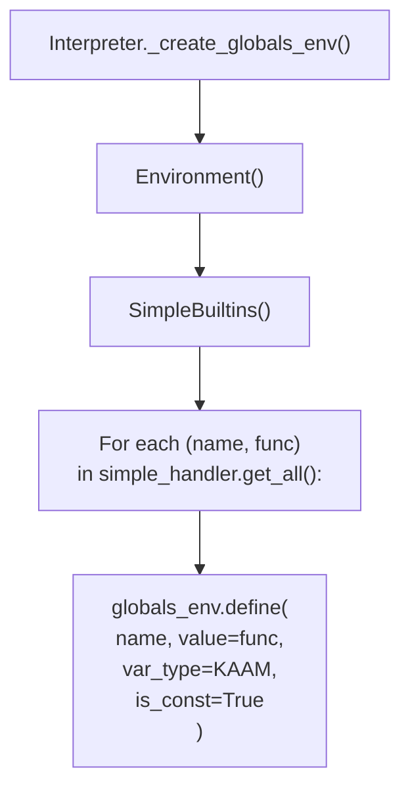
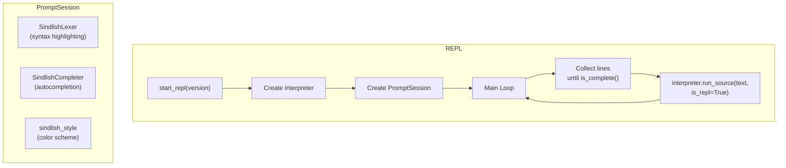
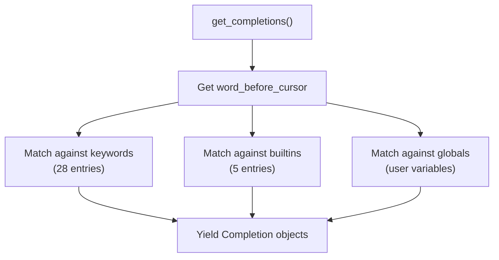
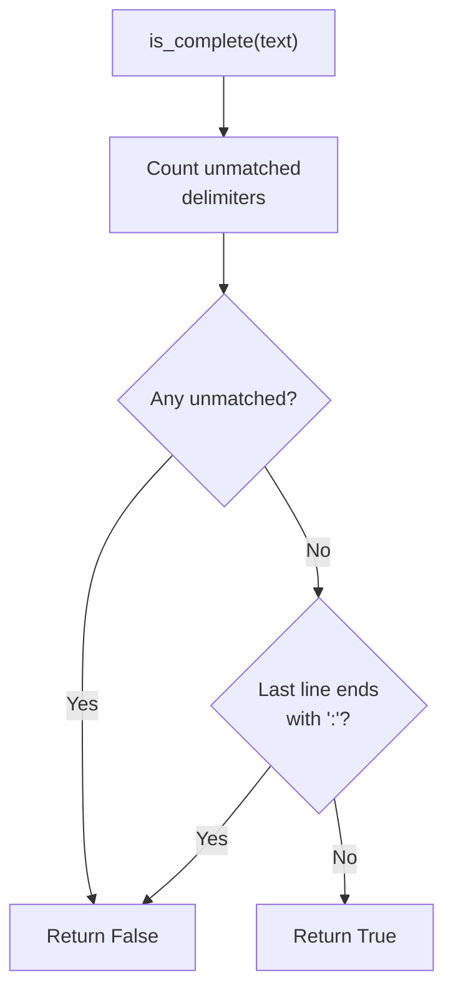
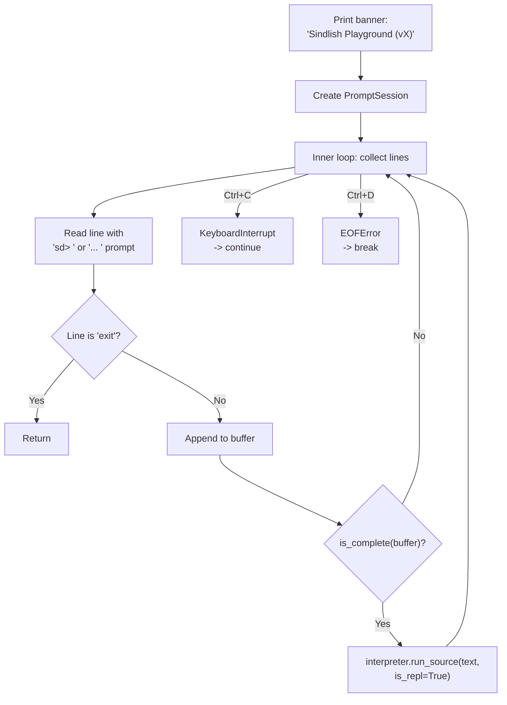

# Runtime: Environment, Builtins, and REPL

The runtime subsystem provides variable storage (`Environment`), built-in functions (`SimpleBuiltins`), and the interactive REPL (`repl.py`).

---

## Environment (`interpreter/runtime/env.py`)

The `Environment` class is the symbol table used at runtime for variable storage. It supports lexical scoping through a parent chain.

### Data Structures

```python
@dataclass(slots=True)
class VariableRecord:
    value: Any  # The runtime value
    type: TokenType | None = None  # Declared type (None if untyped)
    element_type: list | TokenType | None = None  # For typed collections
    is_const: bool = False  # pakko (const) flag
```

### Environment Class

```python
class Environment:
    def __init__(self, parent=None):
        self.records: dict[str, VariableRecord] = {}
        self.parent: Environment | None = parent
        self.global_names: set = set()
        self.nonlocal_names: set = set()
```

### Scope Chain



### Key Methods

#### `define(name, value, var_type, is_const, element_type)`

Creates a new `VariableRecord` in the current environment:

```python
def define(self, name, value, var_type=None, is_const=False, element_type=None):
    self.records[name] = VariableRecord(value, var_type, element_type, is_const)
    return value
```

#### `lookup_record(name, node, code) -> VariableRecord`

Walks the parent chain to find a variable:



#### `assign(name, value, node, code)`

Updates an existing variable's value. Raises `HalndeVaktGhalti` if the variable is `pakko` (const):



#### `resolve_scope(name) -> Environment`

Returns the `Environment` that owns a given name, or `None` if not found anywhere.

### Variable Access in the VM

The VM uses two mechanisms for variable access:

| Scope Level | Access Method | Storage |
|-------------|---------------|---------|
| 0 (local) | `LOAD_FAST` / `STORE_FAST` | `frame.slots[i]` (O(1) array) |
| 1 (global) | `LOAD_GLOBAL` / `STORE_GLOBAL` | `globals.records[name]` (O(n) dict) |

Local variables use slot-based array access for O(1) performance. Global variables use dictionary lookup. The Resolver determines scope level during the analysis phase.

---

## Built-in Functions (`interpreter/runtime/builtins.py`)

Five functions are available in the global scope without declaration.

### Registration System

```python
class SimpleBuiltins:
    functions = {}  # Class-level shared registry

    @staticmethod
    def _register(registry_dict):
        def decorator(func):
            registry_dict[func.__name__] = func
            return func

        return decorator
```

Functions are registered via the `@_register` decorator pattern.

### Built-in Function Reference

#### `likh(*args)` — Print

```python
def likh(self, args):
    print(*(str(arg) for arg in args))
    return SdNull()
```

Prints all arguments space-separated. Returns `khali`.

**Examples:**
```
likh("hello")           # prints: hello
likh(1, 2, 3)           # prints: 1 2 3
likh()                   # prints: (empty line)
```

#### `puch(*prompt)` — Input

```python
def puch(self, args):
    prompt = " ".join(str(arg) for arg in args)
    result = input(prompt)
    return SdString(result)
```

Reads user input with optional prompt. Returns `SdString`.

**Examples:**
```
lafz name = puch("Name: ")     # Displays "Name: ", reads input
lafz val = puch()               # Reads input without prompt
```

#### `lambi(obj)` — Length

```python
def lambi(self, args):
    if len(args) != 1:
        raise HalndeVaktGhalti(...)
    obj = args[0]
    if hasattr(obj, "elements"):  # SdList or SdSet
        return SdNumber(len(obj.elements))
    if hasattr(obj, "value"):
        if isinstance(obj.value, (str, dict)):
            return SdNumber(len(obj.value))
    raise QisamJeGhalti(...)
```

Returns the length of a collection or string.

**Supported types:**
- `SdList` → `len(elements)`
- `SdDict` → `len(value)` (dict length)
- `SdSet` → `len(elements)`
- `SdString` → `len(value)` (string length)

#### `range(n)`, `range(a, b)`, `range(a, b, s)` — Number Range

```python
def range_builtin(self, args):
    if len(args) == 1:
        return SdList([SdNumber(i) for i in range(0, int(args[0].value), 1)])
    elif len(args) == 2:
        return SdList(
            [SdNumber(i) for i in range(int(args[0].value), int(args[1].value), 1)]
        )
    elif len(args) == 3:
        return SdList(
            [
                SdNumber(i)
                for i in range(
                    int(args[0].value), int(args[1].value), int(args[2].value)
                )
            ]
        )
```

Creates a list of integers.

| Signature | Result |
|-----------|--------|
| `range(5)` | `[0, 1, 2, 3, 4]` |
| `range(2, 7)` | `[2, 3, 4, 5, 6]` |
| `range(0, 10, 2)` | `[0, 2, 4, 6, 8]` |
| `range(10, 0, -2)` | `[10, 8, 6, 4, 2]` |

#### `majmuo(*args)` — Set Constructor

```python
def majmuo(self, args):
    if len(args) == 0:
        return SdSet(set())
    elif len(args) == 1:
        return SdSet(set(args[0]))
```

Creates a new set. With 0 args, returns empty set. With 1 arg, iterates the argument to build the set.

### Global Environment Setup



All 5 builtins are registered as constants of type `KAAM` (function) in the global environment.

---

## REPL (`interpreter/repl.py`)

The REPL provides an interactive Read-Eval-Print Loop with syntax highlighting, autocompletion, and multiline input.

### Architecture



### Syntax Highlighting: `SindlishLexer`

A prompt_toolkit `Lexer` subclass that provides regex-based syntax highlighting:

| Token Class | Regex Pattern | Color |
|-------------|---------------|-------|
| `comment` | `\#.*` | Blue-gray (`#6272a4`) |
| `string` | `"(?:\\.\|[^"\\])*"\|'...'` | Yellow (`#f1fa8c`) |
| `number` | `\b\d+(?:\.\d+)?\b` | Purple (`#bd93f9`) |
| `keyword` | `\b(agar\|yawari\|warna\|...)\b` | Pink (`#ff79c6`) |
| `datatype` | `\b(adad\|lafz\|dahai\|...)\b` | Cyan italic (`#8be9fd`) |
| `builtin` | `\b(likh\|puch\|lambi\|...)\b` | Green (`#50fa7b`) |
| `operator` | `[+\-*/%^=><!?]+` | Orange (`#ffb86c`) |
| `identifier` | `\b[a-zA-Z_]\w*\b` | White (`#f8f8f2`) |

### Autocompletion: `SindlishCompleter`

Provides completions from three sources:



### Multiline Input Detection: `is_complete()`

Checks whether the user's input is syntactically complete:

1. Counts unmatched delimiters (braces, parens, brackets) — tracks string state to avoid counting inside strings
2. Checks if the last line ends with `:` (expecting an indented block)
3. Returns `True` only when all delimiters are balanced and no trailing colon



### REPL Loop



### Prompt Format

| Context | Prompt |
|---------|--------|
| New input | `sd> ` |
| Continuation | `... ` |

The REPL uses the ContinuationPrompt for multiline input (e.g. when inside an if block or function definition).
