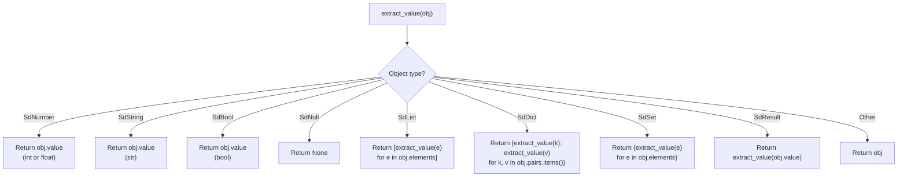

# Testing

Sindlish uses pytest as its test framework. The test suite covers all major language features with 23 test files and 236+ test cases.

## Running Tests

```bash
# Run all tests
uv run pytest

# Run with verbose output
uv run pytest -v

# Run a specific test file
uv run pytest tests/test_variables.py

# Run a specific test class
uv run pytest tests/test_arithmetic.py::TestAddition

# Run a specific test
uv run pytest tests/test_arithmetic.py::TestAddition::test_add_two_integers
```

## Test Infrastructure (`tests/conftest.py`)

Three helper functions power all tests:

### `run(code) -> VM`

Executes Sindlish source code through the full pipeline (Lexer -> Parser -> Resolver -> Compiler -> VM) and captures stdout:

```python
def run(code):
    import io
    import sys

    old_stdout = sys.stdout
    sys.stdout = buffer = io.StringIO()

    interp = Interpreter()
    vm = interp.run_source(code, is_repl=True)

    sys.stdout = old_stdout
    vm.stdout_output = buffer.getvalue()
    return vm
```

### `get_variable_value(vm, name) -> Any`

Extracts a variable value from the VM's slot-based storage:

```python
def get_variable_value(vm, name):
    # Check globals first
    if name in vm.globals.records:
        return vm.globals.records[name].value
    # Then check current frame slots
    frame = vm.frames[-1]
    for i, val in enumerate(frame.slots):
        metadata = frame.slot_metadata.get(i, {})
        if metadata.get("name") == name:
            return val
```

### `extract_value(sd_object) -> Python primitive`

Recursively unwraps Sindlish runtime objects into native Python values for assertions:



## Test Patterns

### Basic Pattern

```python
def test_add_two_integers():
    vm = run("adad x = 3 + 5")
    assert extract_value(get_variable_value(vm, "x")) == 8
```

### Printing Pattern

```python
def test_print_string():
    vm = run('likh("hello")')
    assert vm.stdout_output.strip() == "hello"
```

### Error Pattern

```python
def test_undefined_variable():
    with pytest.raises(NaleJeGhalti):
        run("likh(x)")
```

### Method Call Pattern

```python
def test_list_append():
    vm = run("""
        fehrist adad nums = [1, 2, 3]
        nums.wadha(4)
    """)
    assert extract_value(get_variable_value(vm, "nums")) == [1, 2, 3, 4]
```

## Test File Index

| Test File | What It Tests | Key Features |
|-----------|---------------|--------------|
| `test_variables.py` | Dynamic typing, assignment, reassignment | Variable declaration across types |
| `test_typed_variables.py` | Typed declarations, type enforcement | `adad x = 5`, `x: adad = 5`, `fehrist[adad] x = []` |
| `test_constants.py` | `pakko` declarations, immutability | Const enforcement, required initialization |
| `test_arithmetic.py` | All 6 arithmetic operators | `+`, `-`, `*`, `/`, `%`, `^`, unary minus, precedence |
| `test_comparisons.py` | Comparison operators | `==`, `!=`, `>`, `<`, `>=`, `<=` |
| `test_logical_ops.py` | Logical operators | `aen`, `ya`, `nah`/`!`, combined expressions |
| `test_booleans.py` | Boolean literals | `sach`, `koorh`, booleans in conditions |
| `test_print.py` | `likh()` function | Strings, numbers, expressions, multiple args |
| `test_if_else.py` | Conditional statements | `agar`, `warna`, `yawari`, nesting |
| `test_while.py` | While loops | `jistain` with counters, accumulation |
| `test_loops.py` | For loops, break, continue | `har...mein`, `tor`, `jari`, `range()` |
| `test_lists.py` | List operations | Literals, indexing, negative index, typed lists |
| `test_list_methods.py` | 11 list methods | `wadha`, `wadhayo`, `wajh`, `hata`, `kadh`, etc. |
| `test_dicts.py` | Dict operations | Literals, bracket indexing, assignment, typed dicts |
| `test_dict_methods.py` | 10 dict methods | `hasil`, `cabeyon`, `raqamon`, `syon`, etc. |
| `test_sets.py` | Set operations | Literals, `majmuo()`, typed sets |
| `test_set_methods.py` | 14 set methods | `addkar`, `chad`, `bade`, `milap`, `farq`, etc. |
| `test_strings.py` | String operations | Single/double/triple quotes, escapes, multiline |
| `test_builtins.py` | Built-in functions | `lambi()`, `likh()` as function call |
| `test_comments.py` | Comment support | `#` line comments, `/* */` block comments |
| `test_errors.py` | Error cases | Undefined vars, const reassignment, type mismatches |

Additionally, 3 `.sd` test scripts exist for manual testing:

| File | Tests |
|------|-------|
| `test_results.sd` | Result system (`ok`/`ghalti`/`?`/`!!`/`bachao`/`lazmi`) |
| `test_panic_unwrap.sd` | Panic unwrap behavior |
| `test_panic_stmt.sd` | `kharabi()` statement |

## Adding a New Test

### Step-by-step

1. **Create or edit a test file** in `tests/`:

```python
# tests/test_my_feature.py
import pytest
from conftest import run, get_variable_value, extract_value
from interpreter.errors import QisamJeGhalti


class TestMyFeature:
    def test_basic_case(self):
        vm = run("adad x = 10")
        assert extract_value(get_variable_value(vm, "x")) == 10

    def test_with_printing(self):
        vm = run('likh("hello")')
        assert vm.stdout_output.strip() == "hello"

    def test_error_case(self):
        with pytest.raises(QisamJeGhalti):
            run("adad x = \"hello\"")
```

2. **Run the test** to verify:

```bash
uv run pytest tests/test_my_feature.py -v
```

3. **Add to `test.sd` or create `.sd` files** for manual integration testing if needed.

## Test Naming Conventions

- Test files: `test_<feature>.py`
- Test classes: `Test<Feature>` (e.g. `TestAddition`, `TestIfElse`)
- Test methods: `test_<description>` (e.g. `test_add_two_integers`)
- Use descriptive names that explain what is being tested

## CI Integration

Tests are automatically run on every push and PR via GitHub Actions:

```yaml
# .github/workflows/ci.yml
- name: Run tests
  run: uv run pytest
```

The CI uses `uv` for dependency management and runs on `ubuntu-latest`.
